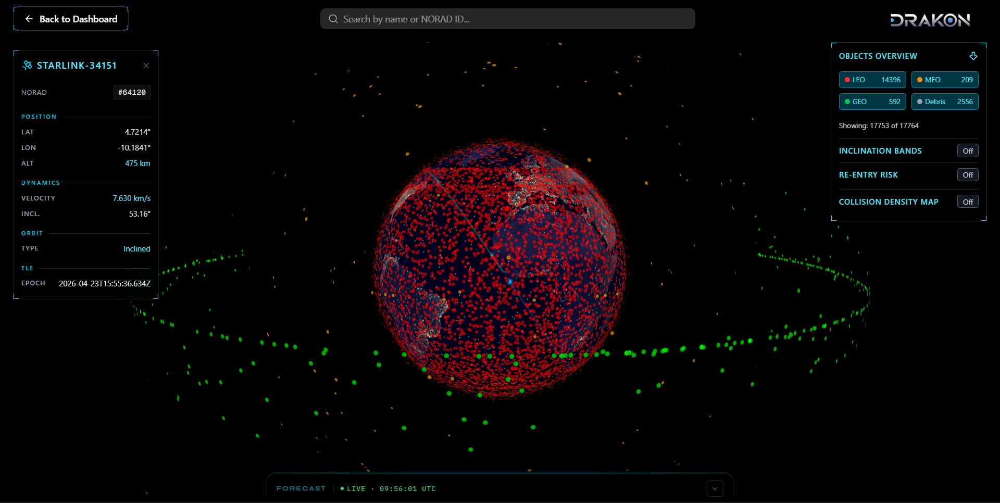
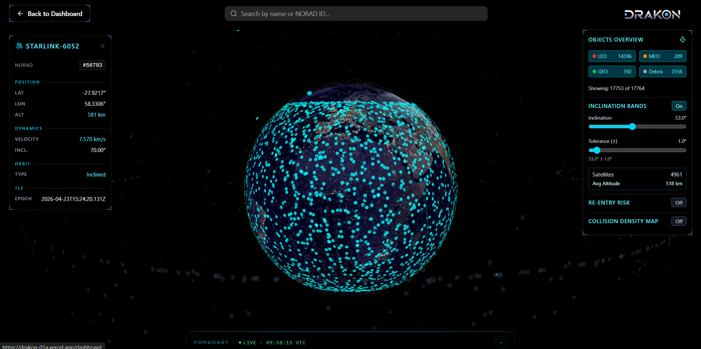
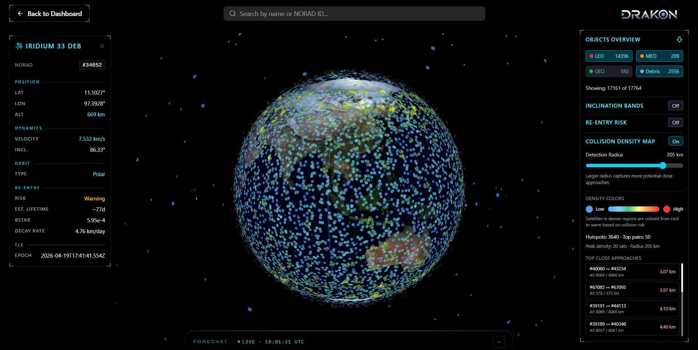
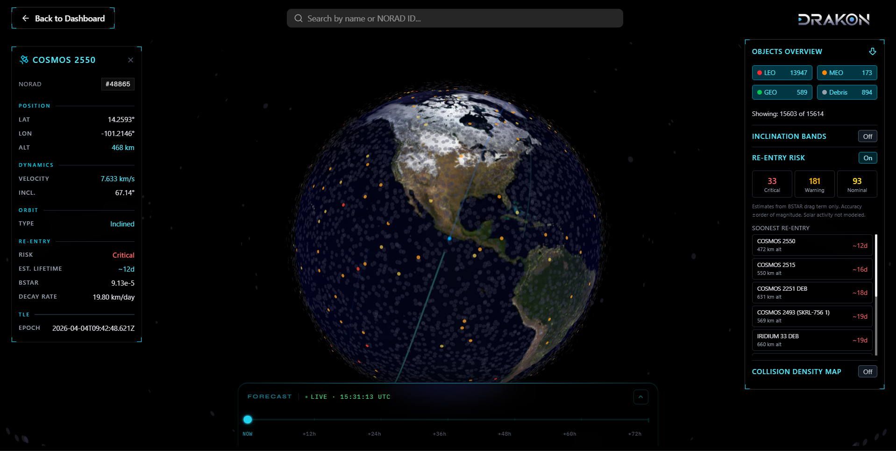

# DRAKON (In development)

### Orbital Decision Intelligence Platform

**DRAKON** is an interactive satellite operations dashboard that visualizes real-time orbital objects, screens potential close approaches, monitors fleet state, and provides orbital trend and re-entry analysis.
The platform combines satellite catalog data, SGP4 orbit propagation, spatial screening, historical orbital analysis, and predictive analytics to enhance situational awareness and operational safety.

DRAKON's current collision functionality is a **close-approach density and screening system**, not yet a full conjunction-prediction engine. Advanced conjunction prediction, maneuver planning, and operational alerting remain part of the planned roadmap.

---

## 📸 Screenshots / Demo

<div style="display: flex; gap: 10px; flex-wrap: wrap; justify-content: center;">
    
    
    
    
</div>

---

## Current MVP Features

- **Interactive 3D / 2D Globe:** Real-time visualization of orbital objects using TLEs and SGP4 propagation through `satellite.js`.
- **Fleet Health Overview:** Orbit breakdown across LEO / MEO / GEO / debris classifications.
- **Satellite Details Panel:** Display NORAD ID, velocity, inclination, orbit type, and related metadata.
- **Orbital Plane Visualization:** Inclination-band analysis with representative ground-track rendering and satellite highlighting.
- **Satellite Trajectory Visualization:** Selected-satellite 2D past/future ground tracks and 3D orbital paths.
- **Collision Density Screening:** On-demand voxel-based close-approach screening with per-satellite density, hotspot statistics, and candidate-pair visualization.
- **Historical Trends:** Multi-epoch orbital trend analysis backed by `tle_history`, asynchronous trend jobs, and persisted derived state.
- **Re-entry Screening:** Identifies objects that are actively decaying and estimates whether they may re-enter Earth's atmosphere within a meaningful time window.
- **Decision Trace:** Object-level re-entry analysis showing the signals, evidence, classification changes, and reasoning behind the derived assessment.

The dashboard also contains **Proximity Timeline**, **Critical Alerts**, and related operational widgets as part of the product scope; these areas are currently scaffolded while the underlying conjunction-prediction and real-time alerting systems remain under development.

---

## Planned Features

- Optimized conjunction prediction engine with spatial indexing.
- Maneuver planner and Δv cost modeling.
- Multi-tenant organization support.
- Enhanced caching and geospatial queries (PostGIS).
- UI/UX improvements and advanced visual analytics.
- Real-time updates with WebSockets or managed services.
- System monitoring using Grafana and Prometheus.

---

## Tech Stack

| Layer                 | Technologies                                                                                                                                                                                 |
| --------------------- | -------------------------------------------------------------------------------------------------------------------------------------------------------------------------------------------- |
| **Frontend**          | Next.js 15 (App Router), React 19, TypeScript, Tailwind CSS, shadcn/ui                                                                                                                       |
| **3D Visualization**  | deck.gl (GlobeView) + BitmapLayer day/night Earth texture                                                                                                                                    |
| **Charts**            | Apache ECharts (`echarts/core`, tree-shaken -- see `components/Charts/`)                                                                                                                     |
| **Orbit Propagation** | satellite.js (SGP4), Comlink Web Workers                                                                                                                                                     |
| **State Management**  | Redux Toolkit (visualization state) + TanStack Query v5 (all data fetching)                                                                                                                  |
| **Backend / API**     | Next.js API Routes (serverless)                                                                                                                                                              |
| **Database**          | Neon PostgreSQL (serverless HTTP driver) via Drizzle ORM -- `tle_history`, `object_trends`, `trend_snapshots`, `geomagnetic_shadow_runs`, `geomagnetic_shadow_object_deltas`, etc.               |
| **Cache**             | Upstash Redis (HTTP-based, serverless-compatible) -- 2h live TTL + permanent stale fallback                                                                                                 |
| **TLE Source**        | Space-Track `gp` class (primary, payload + rocket-body) with CelesTrak NORAD GP catalog as fallback and as the permanent source for iridium-33-debris, cosmos-2251-debris, fengyun-1c-debris |
| **Scheduling**        | cron-job.org (hourly TLE ingest via `/api/internal/ingest-tle`, 15min trend worker, partition maintenance, daily solar flux refresh, hourly geomagnetic index + shadow observation refresh)   |
| **CI/CD**             | GitHub Actions -> Vercel                                                                                                                                                                     |

---

## Project Structure

```bash
drakon/
|- app/
|  |- api/
|  |  |- socket/                # Reserved for realtime socket route(s)
|  |  |- tle/
|  |  |  `- route.ts            # Pure read: Redis (`tle:combined`) -> client. No fetching or writing of its own -- see internal/ingest-tle/route.ts
|  |  |- solar-flux/route.ts    # GET (read) / POST (refresh from NOAA)
|  |  |- object-trends/
|  |  |  |- route.ts            # Bulk read of object_trends
|  |  |  |- recent-changes/route.ts       # Latest snapshots per object, catalog-wide (dashboard triage)
|  |  |  `- [noradId]/
|  |  |     |- history/route.ts           # Raw tle_history time series (Analysis page charts)
|  |  |     |- explain/route.ts           # Persisted trend-model reasoning (signal breakdown)
|  |  |     `- snapshots/route.ts         # Full change history for one object
|  |  `- internal/
|  |     |- process-trends/route.ts       # Trend worker drain (cron-job.org, 15min)
|  |     |- requeue-stale/route.ts        # Version-invalidation requeue
|  |     |- ingest-tle/route.ts           # Space-Track/CelesTrak merge cycle
|  |     `- manage-tle-partitions/route.ts # Daily partition create-ahead/drop-stale maintenance
|  |- dashboard/
|  |  |- components/
|  |  |  |- layout/
|  |  |  |  |- Sidebar.tsx      # Dashboard sidebar navigation
|  |  |  |  `- Topbar.tsx       # Dashboard header
|  |  |  `- UnderDevelopment.tsx
|  |  |- reentry/
|  |  |  |- page.tsx            # Triage dashboard: New/Escalated / Active / Watching tabs
|  |  |  |- [noradId]/
|  |  |  |  |- page.tsx         # Analysis / Decision Trace page for one object
|  |  |  |  |- components/ReentryAnalysisPage.tsx
|  |  |  |  `- lib/             # buildReentryTrace, buildReentryChartOptions, buildChangeTimeline, formatTimestamp
|  |  |  |- components/         # ReentryTable, ReentryDetailPanel, ReentryTableNavigation, ReentryStatsBar, ...
|  |  |  |- hooks/useReentryScreening.ts
|  |  |  `- lib/                # buildTriageBuckets, constants, formatters
|  |  |- layout.tsx             # Sidebar + Topbar layout
|  |  `- page.tsx               # Dashboard entry page
|  |- globe/
|  |  |- GlobeContent/
|  |  |  |- components/
|  |  |  |  |- panels/
|  |  |  |  |  |- LeftPanel.tsx
|  |  |  |  |  `- RightPanel.tsx
|  |  |  |  |- DensityLegend.tsx
|  |  |  |  |- ForeCastOverlay.tsx
|  |  |  |  `- MobileViewNotice.tsx
|  |  |  |- Globe3D.tsx         # deck.gl 3D globe renderer + layers
|  |  |  |- GlobeContainer.tsx  # Main globe composition and state wiring
|  |  |  `- Map2d.tsx           # 2D map renderer
|  |  `- page.tsx
|  |- [...slug]/
|  |  `- page.tsx
|  |- globals.css
|  |- layout.tsx                # Root layout with providers
|  `- page.tsx
|- components/
|  |- MiniGlobe/                # Compact globe preview (reentry dashboard, detail panels)
|  |- Charts/                   # EChart wrapper + drakonTheme -- shared by every chart in the app
|  `- DecisionTrace/            # Generic Verdict -> Trace -> Evidence shell (DecisionTrace, TraceStep)
|- hooks/
|  |- useTleEntriesQuery.ts     # TanStack Query hook -- fetches + parses TLE text
|  |- useObjectTrendsQuery.ts   # Bulk object_trends fetch
|  |- useObjectExplainQuery.ts / useObjectHistoryQuery.ts / useObjectSnapshotsQuery.ts / useRecentTrendChangesQuery.ts
|  |- useSatellitePositions.ts  # Live SGP4 positions, 5s interval
|  |- useSimulatedPositions.ts  # Projected positions at T+offset
|  |- useSelectedSatelliteTracks.ts      # Past + future ground track for selected satellites
|  |- useSelectedSatelliteOrbitPaths.ts  # 3D orbital path for selected satellites
|  |- useInclinationBands.ts    # Orbital plane band membership + representative ground track
|  |- useCollisionDensity.ts    # Voxel-based close-approach density computation
|  `- useSatelliteMetadata.ts   # Loads precomputed satellite metadata
|- lib/
|  |- store.ts                  # Redux store (visualization slice only)
|  |- visualization-slice.ts    # Filters, bands, density, simulation, re-entry flags
|  |- satellite.ts              # Synchronous SGP4 helpers (positionFromTLE etc.)
|  |- satelliteWorker.ts        # Comlink async wrappers + in-memory cache (CACHE_MAX=1000)
|  |- satelliteHelpers.ts       # parseBSTAR, parseMeanMotionDot, getReentryRisk, altitude-based estimate, tier assignment
|  |- objectTrendRisk.ts        # resolveReentryRisk -- combines single/multi-epoch layers, pessimistic-of-two
|  |- explainReentryTrend.ts    # classifyDecaySignal, estimateReentry, reconstructSignalContributions
|  |- reentrySignals.ts         # Cross-signal agreement helpers
|  |- solarFlux.ts              # NOAA F10.7 fetch + density multiplier
|  |- redis.ts                  # Upstash Redis client singleton
|  |- providers.tsx             # Redux + TanStack QueryClient providers
|  |- types.ts                  # TleEntry, SatellitePoint, ReentryRisk, ObjectTrend, metadata types
|  |- utils.ts
|  |- db/
|  |  |- index.ts               # Drizzle + Neon HTTP client
|  |  `- schema.ts              # Table definitions
|  |- jobs/
|  |  |- ingestTleHistory.ts    # History + archive writes, concurrent chunk processing, job enqueue
|  |  |- computeObjectTrends.ts # Regression, classification, trend worker
|  |  `- requeueStaleObjects.ts # Version invalidation sweep
|  |- tle-providers/            # TLEProvider abstraction
|  |  |- types.ts               # ProviderName, TleFetchOptions/Result, TLEProvider interface
|  |  |- celestrak.ts           # CelesTrakProvider -- provider implementation
|  |  |- spacetrack.ts           # SpaceTrackProvider -- session-cookie auth, predicate-scoped `gp` class query
|  |  |- mock.ts                # MockProvider -- deterministic fixture incl. one Alpha-5 object, for tests/CI
|  |  `- index.ts                # getPrimaryProvider()/getFallbackProvider(), keyed off TLE_PROVIDER
|  `- workers/
|     `- satellite.worker.ts    # Comlink worker: SGP4, density, ground tracks, 3D orbit paths
|- docs/
|  |- ORBITAL_PLANE_VISUALIZATION.md
|  |- COLLISION_DENSITY_MAP.md
|  |- REENTRY_RISK.md
|  `- TLE_HISTORY_PIPELINE.md
|- drizzle/                     # SQL migrations
|- scripts/
|  `- build-satellite-metadata.ts  # Metadata build/precompute script
|- public/
|- package.json
|- tsconfig.json
`- README.md
```

---

## Data & Caching Architecture

### TLE Pipeline

Two sources behind one interface: **Space-Track** (primary, broader payload + rocket-body catalog) and **CelesTrak** (always for the three debris clouds -- iridium-33-debris, cosmos-2251-debris, fengyun-1c-debris -- and the automatic fallback if Space-Track fails). An hourly job (`POST /api/internal/ingest-tle`) merges fresh data into the existing Redis snapshot — never overwrites it — and writes per-source-labeled rows to `tle_history`. The client-facing `GET /api/tle` is a pure read path: Redis in, plain text out, no fetching or writing of its own.

Full architecture — provider interface, the merge/prune algorithm, Redis key roles, partition maintenance — is in **[docs/TLE_PIPELINE_ARCHITECTURE.md](./docs/TLE_PIPELINE_ARCHITECTURE.md)**. What happens to the data after ingestion (history storage, trend computation, screening) is in [docs/TLE_HISTORY_PIPELINE.md](./docs/TLE_HISTORY_PIPELINE.md).

### TLE Groups (CelesTrak)

These are CelesTrak's named groups — used for the three debris clouds unconditionally, and for `active` only when Space-Track itself is unreachable and CelesTrak is serving as fallback. Space-Track's own primary query isn't scoped by these group names at all (see docs/TLE_PIPELINE_ARCHITECTURE.md).

| Group                | Contents                                          |
| -------------------- | ------------------------------------------------- |
| `active`             | ~15000 operational satellites                     |
| `iridium-33-debris`  | ~700 fragments from 2009 Iridium/Cosmos collision |
| `cosmos-2251-debris` | ~1500 fragments from 2009 collision               |
| `fengyun-1c-debris`  | ~3000 fragments from 2007 Chinese ASAT test       |

### Client-Side Caching (TanStack Query)

```typescript
staleTime: 2 * 60 * 60 * 1000,  // matches Redis TTL — no redundant refetches
gcTime:    4 * 60 * 60 * 1000,
refetchOnWindowFocus: false,
```

---

## State Management

Two separate systems handle different concerns:

**Redux Toolkit** (`lib/visualization-slice.ts`) — ephemeral UI state that doesn't need to persist or be shared across sessions: active filters, simulation offset, selected satellite ID, band/density/re-entry toggle flags.

**TanStack Query** (`hooks/useTleEntriesQuery.ts`) — server data with lifecycle management: TLE fetching, caching, background revalidation, deduplication across components. Replaced the previous `tle-slice.ts` Redux slice.

---

### Advanced Visualization Features

#### Orbital Plane Visualization (Inclination Bands)

- Inclination-band membership using target inclination ± tolerance
- Inclination slider (0–120°) + tolerance control (±0.5–10°)
- Satellite highlighting within the selected band
- Real-time band membership count + average altitude
- Representative ground track selected by median mean motion and generated over one orbit with 240 samples
- Worker-backed propagation, 300ms debounced inputs, and in-memory track cache
- Antimeridian-aware track segmentation

**Selected Satellite Paths**

- **2D ground track:** one orbital period into the past + one orbital period into the future, 120 samples per direction
- Temporal opacity emphasizes the current position and fades toward older/future portions of the track
- **3D orbit path:** one complete orbit centered on simulation time, 240 samples with longitude/latitude/altitude
- 3D orbit altitude is intentionally exaggerated by the renderer for visual readability
- Both path types are generated through the Comlink satellite worker and update when simulation time or the selected satellite state changes

📖 See [docs/ORBITAL_PLANE_VISUALIZATION.md](./docs/ORBITAL_PLANE_VISUALIZATION.md)

#### Collision Density Map

- Near-linear voxel-grid spatial index with 27-cell neighborhood search, replacing O(N²) brute-force pair enumeration
- 3D ECEF coordinates for spatial candidate generation
- Configurable detection radius (10–250 km); voxel size follows `max(detectionRadiusKm, 20)`
- Candidate-pair filtering using launch/metadata heuristics, close separation + altitude similarity, and SGP4 relative-velocity checks
- Per-satellite close-approach density normalization via `satelliteDensities` map (O(1) lookup)
- Fixed 2° geographic hotspot grid for aggregate density statistics
- Up to 50 candidate pairs returned for map/list rendering; aggregate density statistics are computed from the full filtered pair set
- Line layer for close-approach pairs, color-coded by distance threshold
- 500ms debounced computation and worker-backed execution

📖 See [docs/COLLISION_DENSITY_MAP.md](./docs/COLLISION_DENSITY_MAP.md)

#### Re-Entry Risk Screening

Two-layer screening, resolved together in `lib/objectTrendRisk.ts`: a fast single-epoch BSTAR/N-dot model (`getReentryRisk`, used for debris/rocket-body screening) and a multi-epoch regression model over 7-30 days of `tle_history` (`recomputeTrends`, required for active payloads -- a single TLE epoch's BSTAR is too maneuver-contaminated to trust alone). For objects below the altitude threshold, the two are resolved by taking whichever estimate is **more pessimistic**, so a stale multi-epoch trend can never mask a live, rapidly-decaying object.

**Risk tiers:** Critical (< 30 days) -> Warning -> Nominal -> Stable, with warning/nominal limits compressing at higher altitudes where single-epoch signals are less reliable.

**Decision Trace (Analysis page, `/dashboard/reentry/[noradId]`):** every flagged object has a dedicated page showing _why_ DRAKON reached its conclusion, not just the conclusion -- a one-line synthesized summary, then an expandable trace walking through each signal (load history -> BSTAR -> N-dot -> altitude -> consensus -> verdict) as a connected pipeline, backed by the exact persisted values that drove the tier assignment, plus evidence charts and a full change-history timeline (when did this object's classification last change, and in which direction).

**Dashboard triage (`/dashboard/reentry`):** objects are grouped into New/Escalated, Active, and Watching using `trend_snapshots` -- an append-only log of classification changes -- rather than a flat sort, so the list answers "what needs attention right now" instead of just "what's currently bad."

See [docs/REENTRY_RISK.md](./docs/REENTRY_RISK.md) for the full model and architecture, and [docs/TLE_HISTORY_PIPELINE.md](./docs/TLE_HISTORY_PIPELINE.md) for the pipeline and schema.

#### Predictive Time Simulation

- Redux: `simulationOffsetHours`, `isSimulating`, `simLoading`
- `useSimulatedPositions` hook: debounced initial compute, periodic refresh
- `batchPositionAtOffsetAsync`: stamps all entries with `Date.now() + offsetMs`
- ForecastOverlay: IBM Plex Mono, 72h window, drag scrubber, amber warning beyond 48h (SGP4 accuracy degrades)
- `simLoading` in Redux so ForecastOverlay subscribes independently without prop drilling

### Performance Optimizations

**Worker architecture:**

- Single persistent Comlink worker (`satellite.worker.ts`) — no per-call worker spawn overhead
- In-memory LRU-style cache in `satelliteWorker.ts` (`CACHE_MAX=1000`, FIFO eviction)
- `batchPositionFromTLE` sends entire array in one Comlink call, not per-satellite messages

**isDebris classification** (in `useTleEntriesQuery.ts`):

```typescript
const isDebris =
  lowerName.includes('deb') || // DEB, DEBRIS
  lowerName.includes('r/b') || // rocket bodies
  lowerName.includes('rkt') || // older catalog names
  lowerName.includes('rocket') ||
  lowerName.includes('platform'); // defunct platforms
```

Used for globe coloring (gray dots) and as a gate in `getReentryRisk` for re-entry screening.

### In Progress 🔄

- **Alerts Panel**: WebSocket-based real-time updates for collision warnings
- **Conjunction Screening**: Advanced collision prediction algorithms
- **Historical Analysis**: Time-based tracking of density and close approaches

---

## Pending / Backlog Features

- **Conjunction timeline**: Sweep T+0 to T+72h, chart pair counts over time
- **Hohmann transfer maneuver planner**: dV calculator for orbit transfers
- **Re-entry footprint corridor**: Show ground track corridor on globe for objects within 7 days
- **Space-Track CDM integration**: Conjunction Data Messages (requires account + backend job)
- **Stale data timestamp header**: `x-stale-since` response header + frontend freshness warning banner
- **Automated partition maintenance**: implemented for the current architecture; daily partition creation and stale-partition cleanup are now handled by `/api/internal/manage-tle-partitions`. Remaining work is operational scheduling/migration cleanup rather than implementation of the maintenance routine itself.
- **`tle_archive` restructure**: only the latest name per object is ever read -- an upsert-in-place table would be simpler than an append-and-prune one

---

## Database Schema (PostgreSQL -- Neon, via Drizzle ORM)

| Table                 | Description                                                                                                                                                                                             |
| --------------------- | ------------------------------------------------------------------------------------------------------------------------------------------------------------------------------------------------------- |
| **`tle_history`**     | Time-series of parsed orbital parameters per NORAD ID, range-partitioned by `epoch`. The current migration uses daily partitions from the September 2026 cutover while legacy monthly partitions remain compatible during transition. |
| **`tle_archive`**     | Raw TLE name + line 1 + line 2, one row per `(norad_id, epoch)`. Pruned to the 3 most recent rows per object on ingest.                                                                                 |
| **`object_trends`**   | Derived cache, one row per NORAD ID. Regression slopes, decay classification, persisted signal-strength sub-scores, current re-entry estimate, and trend version.                                  |
| **`trend_jobs`**      | Ephemeral work queue for the trend worker. Rows deleted on success, not marked done; failed jobs are retried up to three times before exhaustion.                                                     |
| **`trend_snapshots`** | Append-only log of `object_trends` outcome changes, written only when tier or decay signal actually differs from the last computation. Powers dashboard triage and the Analysis page's change timeline. |

Full column-level detail: [docs/TLE_HISTORY_PIPELINE.md](./docs/TLE_HISTORY_PIPELINE.md)

---

## API Endpoints

| Method | Endpoint                                 | Description                                                                                                                                                                                                                                                           |
| ------ | ---------------------------------------- | --------------------------------------------------------------------------------------------------------------------------------------------------------------------------------------------------------------------------------------------------------------------- |
| `GET`  | `/api/tle`                               | Combined TLE data, served from Redis (`tle:combined`, 2h TTL; falls back to permanent `tle:combined:stale`). Pure read path; no fetching, writing, or background ingestion of its own. |
| `GET`  | `/api/object-trends`                     | Bulk read of current `object_trends` rows |
| `GET`  | `/api/object-trends/[noradId]/history`   | Raw `tle_history` time series for one object -- Analysis page evidence charts |
| `GET`  | `/api/object-trends/[noradId]/explain`   | Persisted trend-model reasoning for one object (signal breakdown, consensus) |
| `GET`  | `/api/object-trends/[noradId]/snapshots` | Full classification-change history for one object -- Analysis page change timeline |
| `GET`  | `/api/object-trends/recent-changes`      | Latest 1-2 snapshots per object, catalog-wide -- dashboard triage grouping |
| `GET`  | `/api/solar-flux`                        | Read current NOAA F10.7 value from Redis |
| `POST` | `/api/solar-flux`                        | Refresh F10.7 from NOAA (cron-job.org, daily) |
| `GET`  | `/api/geomagnetic-index`                 | Read current Kp/ap/activity/multiplier state from Redis (Stage 2, uncalibrated -- `calibrated: false` in every response) |
| `POST` | `/api/geomagnetic-index`                 | Refresh Kp/ap from NOAA (cron-job.org, recommended hourly per plan §15), `x-internal-secret` auth |
| `GET`  | `/api/internal/geomagnetic-shadow`       | Read persisted Stage 2 shadow-mode observations (`?runId=` for one run's per-object deltas; `?source=`/`?limit=`/`?sinceHours=` to filter the list). `x-internal-secret` auth |
| `POST` | `/api/internal/geomagnetic-shadow`       | Run a live shadow comparison against the current catalog + current geomagnetic state, persist it, does not affect production risk scoring (cron-job.org, recommended hourly). `x-internal-secret` auth |
| `POST` | `/api/internal/geomagnetic-shadow/replay`| Replay a historical Kp/ap scenario (default: the real May 2024 Gannon storm) against the current catalog and persist the result (`?label=`, `?asOf=`). `x-internal-secret` auth |
| `POST` | `/api/internal/process-trends`           | Trend worker drain (cron-job.org, every 15 min, `x-internal-secret` auth) |
| `POST` | `/api/internal/requeue-stale`            | Re-enqueue `object_trends` rows on a stale `trend_version` |
| `POST` | `/api/internal/ingest-tle`               | Space-Track (primary) + CelesTrak (debris, always; payload/rocket-body fallback) merge cycle, writes `tle:combined`/`tle:combined:stale` and per-source `tle_history` rows. `x-internal-secret` auth. |
| `POST` | `/api/internal/manage-tle-partitions`    | Ensures the current UTC day plus seven additional daily `tle_history` partitions and drops partitions whose complete range is beyond the 35-day retention cutoff. Idempotent, `x-internal-secret` auth. |

---

## Data Flow

1. An hourly job merges Space-Track (primary) and CelesTrak (debris + fallback) into Upstash Redis (`tle:combined` TTL 2h + `tle:combined:stale` permanent) — see docs/TLE_PIPELINE_ARCHITECTURE.md. `/api/tle` itself is a pure read of that snapshot, with no side effects.
2. Client calls `/api/tle` via TanStack Query (`staleTime: 2h`). Parsed into `TleEntry[]` by `parseTleText` in `useTleEntriesQuery`.
3. `useSatellitePositions` propagates all entries via `batchPositionFromTLEAsync` (Comlink worker) every 5 seconds.
4. `useSimulatedPositions` computes projected positions at T+offset when forecast mode is active.
5. deck.gl layers are recomputed via `useMemo` when filtered satellites, mode flags, or selection changes.
6. User-triggered screening (`showDensity`, `showReentry`, `showBands`) activates the relevant hook and visualization layer.
7. New historical epochs are written to `tle_history`, enqueue one pending trend job per affected NORAD ID, and are later processed asynchronously into `object_trends` and `trend_snapshots`.

---

## Development Setup

```bash
# Clone and install
git clone https://github.com/your-org/drakon
cd drakon
npm install

# Environment variables
cp .env.example .env.local
# Set UPSTASH_REDIS_REST_URL and UPSTASH_REDIS_REST_TOKEN

# Run dev server
npm run dev

# Run tests
npm test
npm run test:watch
```

### Environment Variables

| Variable                   | Description                                                                                                                                                                                                                                      |
| -------------------------- | ------------------------------------------------------------------------------------------------------------------------------------------------------------------------------------------------------------------------------------------------ |
| `UPSTASH_REDIS_REST_URL`   | Upstash Redis REST endpoint |
| `UPSTASH_REDIS_REST_TOKEN` | Upstash Redis auth token |
| `DATABASE_URL`             | Neon PostgreSQL connection string (Drizzle) |
| `INTERNAL_JOB_SECRET`      | Shared secret for `x-internal-secret` header on internal cron routes (`/api/internal/*`) |
| `InDevelopment`            | Set to `"true"` to show UnderDevelopment page for dashboard routes |
| `SPACETRACK_IDENTITY`      | Space-Track account username |
| `SPACETRACK_PASSWORD`      | Space-Track account password |
| `TLE_PROVIDER`             | `spacetrack` (default) or `celestrak`. Read by `getPrimaryProvider()`/`getFallbackProvider()` in `lib/tle-providers/` and actively used by the live ingest path. |

---

## Tests

```bash
lib/satelliteHelpers.test.ts          # BSTAR/N-dot parsing, tier assignment, altitude-based estimate
lib/explainReentryTrend.test.ts       # classifyDecaySignal, estimateReentry, signal reconstruction
lib/objectTrendRisk.test.ts           # resolveReentryRisk -- single/multi-epoch resolution, real fixtures
app/dashboard/reentry/lib/buildTriageBuckets.test.ts
app/dashboard/reentry/[noradId]/lib/buildReentryTrace.test.ts
app/dashboard/reentry/[noradId]/lib/buildReentryChartOptions.test.ts
app/dashboard/reentry/[noradId]/lib/buildChangeTimeline.test.ts
```

Jest configured via `jest.config.js` with `ts-jest`; `roots` covers both `lib/` and `app/`, since several pure functions live alongside the pages that consume them rather than centrally. Worker dependencies are mocked via `jest.mock('./satelliteWorker', ...)`.

---

**License**

DRAKON is source-available under the **[PolyForm Noncommercial License 1.0.0](./LICENSE.md)**