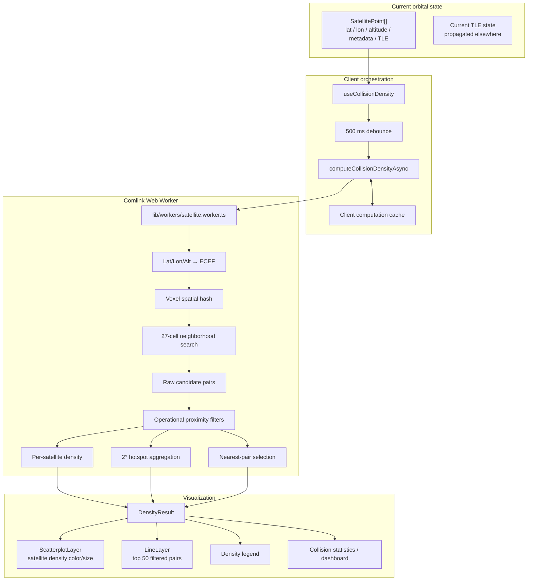

# Collision Density and Close-Approach Map

## 1. Purpose and scope

The Collision Density Map is DRAKON's real-time spatial screening layer for identifying regions and objects with unusually high concentrations of present-time close approaches.

It performs three related tasks:

1. Detect candidate object pairs within a configurable three-dimensional separation radius.
2. Remove proximity relationships that are likely to represent expected operational configurations rather than independent collision candidates.
3. Aggregate the remaining relationships into per-satellite density scores and a fixed-resolution geographic hotspot map for visualization.

The implementation is a **current-state spatial screening model**. It does not propagate two objects forward to determine a future time of closest approach, compute probability of collision, or replace an authoritative conjunction assessment service.

The core computation lives in `lib/workers/satellite.worker.ts` and is exposed to the client through `lib/satelliteWorker.ts` and `hooks/useCollisionDensity.ts`.

## 2. Architectural principles

The design is based on several important decisions:

- Spatial search is performed in Earth-centered Cartesian coordinates rather than latitude/longitude space, avoiding angular-distance errors across longitude boundaries and near the poles.
- A voxel spatial hash reduces the pair-search problem from an all-pairs comparison to a bounded local-neighborhood search.
- The voxel edge length is selected from the detection radius so that a candidate within the configured radius can only exist in the object's own voxel or one of its 26 adjacent voxels.
- Candidate generation and candidate filtering are separate stages. Raw proximity is retained as a diagnostic signal, while operational density and visualization use only filtered relationships.
- Filtering applies inexpensive metadata checks before the more expensive relative-velocity calculation.
- Hotspot counts represent **unique satellites**, not pair multiplicity. A satellite contributes at most once to a hotspot cell during one computation.
- The geographic hotspot grid remains fixed at 2° so changing the detection radius changes the detected population rather than changing the map resolution at the same time.
- All pair computation runs off the main UI thread in a Comlink Web Worker.
- Only the nearest 50 filtered pairs are returned for line/list rendering; aggregate statistics are computed from the complete filtered pair set.
- Density coloring is normalized against the maximum filtered per-satellite density, not the raw proximity count, so large constellations do not dominate the visual scale merely because many members occupy similar regions.

## 3. End-to-end architecture



## 4. Input contract

The worker receives one `DensityWorkerInput` per currently visible/filtered satellite.

| Field | Purpose |
| --- | --- |
| `id` | NORAD/catalog identifier used for pair identity |
| `lat`, `lon` | Current geodetic position in degrees |
| `altKm` | Current altitude above the Earth surface in km |
| `operator` | Operator metadata used by proximity filters |
| `name` | Object name used for same-launch/stack heuristics |
| `l1`, `l2` | TLE lines used for relative-velocity calculation |

The input is a **snapshot**, not a historical trajectory. Position updates elsewhere in the globe pipeline cause the density calculation to be recomputed when the hook's inputs change.

## 5. Computation lifecycle

`useCollisionDensity()` owns the client-side lifecycle.

When density mode is disabled or there are no satellites, the hook clears the current result and loading/error state.

When density mode is enabled:

1. `densityLoading` becomes true immediately.
2. A 500 ms debounce is started.
3. The current `SatellitePoint[]` is converted into the worker input structure.
4. `voxelSizeKm` is set to `max(densityRadiusKm, 20)`.
5. `gridCellSizeDeg` is fixed at 2°.
6. `maxPairs` is fixed at 50 for the visualization payload.
7. `computeCollisionDensityAsync()` submits the calculation to the Comlink worker.
8. If the hook is invalidated while the computation is pending, the result is ignored through a cancellation flag.
9. Successful results populate `densityResult`; worker failures produce an empty result and `densityError`.

The debounce is intended to avoid repeatedly launching expensive spatial calculations while upstream satellite positions or the detection radius are changing rapidly.

## 6. Spatial representation

### 6.1 Geodetic coordinates to ECEF

The worker converts each satellite from latitude, longitude, and altitude into an Earth-centered, Earth-fixed Cartesian position.

The current implementation uses:

```text
R = 6378.137 km
r = R + altitude

x = r · cos(lat) · cos(lon)
y = r · cos(lat) · sin(lon)
z = r · sin(lat)
```

Angles are converted from degrees to radians before evaluation.

The implementation therefore uses a spherical Earth-radius approximation for the spatial-distance calculation rather than a full WGS-84 ellipsoid. The same representation is used consistently for all objects in one calculation.

### 6.2 Voxel key

Each ECEF coordinate is mapped to an integer voxel:

```text
ix = floor(x / voxelSizeKm)
iy = floor(y / voxelSizeKm)
iz = floor(z / voxelSizeKm)
```

The three indices form a string key:

```text
ix,iy,iz
```

A `Map<string, VoxelSat[]>` stores the satellites assigned to each voxel.

## 7. Spatial search algorithm

A naive implementation would compare every satellite with every other satellite, producing approximately `O(N²)` distance checks.

DRAKON instead uses a voxel spatial hash.

For each populated voxel, the worker examines:

```text
Δx ∈ {-1, 0, +1}
Δy ∈ {-1, 0, +1}
Δz ∈ {-1, 0, +1}
```

This produces 27 voxel positions: the current voxel plus its 26 immediate neighbors.

The choice of voxel size is coupled to the detection radius:

```text
voxelSizeKm = max(detectionRadiusKm, 20)
```

Therefore, when `voxelSizeKm >= detectionRadiusKm`, two objects separated by at most the detection radius cannot be more than one voxel away in any Cartesian dimension. The 27-cell neighborhood is consequently sufficient to find all geometric candidates within the configured radius.

This is the main scalability mechanism: the algorithm does not scan the entire catalog for every satellite.

### 7.1 Pair de-duplication

Because the neighborhood traversal can encounter the same pair from either object's voxel, the worker maintains a `processedPairs` set.

Pairs are canonicalized by ascending ID:

```text
minId,maxId
```

The canonical pair key guarantees that each unordered pair is evaluated and counted only once.

The worker also excludes self-pairs and ignores separations of `<= 0.01 km` to avoid treating coincident/degenerate coordinates as meaningful proximity.

## 8. Pass 1 — raw proximity detection

For every unique candidate pair found by the voxel search, the worker calculates the Euclidean ECEF separation:

```text
d = sqrt(dx² + dy² + dz²)
```

A pair becomes a raw candidate when:

```text
d <= detectionRadiusKm
and
d > 0.01 km
```

The worker records:

- object IDs;
- separation distance;
- both altitudes;
- both positions;
- operator metadata.

At the same time it increments `rawSatDensity` for both objects.

`maxRawSatelliteDensity` is the maximum raw pair count observed for any satellite. It is retained for diagnostics and comparison with the post-filter density, but it is **not** used for satellite coloring.

## 9. Pass 2 — operational proximity filtering

Raw geometric proximity does not necessarily indicate an independent collision candidate. Objects can legitimately be close because they were deployed together, are intentionally co-located, or are operating in formation.

`filterCandidatePairs()` applies the following filters in order.

### 9.1 Same-launch / nearby catalog IDs

If:

```text
abs(idA - idB) <= 5
```

the worker performs metadata checks.

A pair is removed when the first normalized name token matches between the two objects. This is treated as a heuristic for a common launch stack or deployment group.

The pair is also removed when both objects have the same non-empty operator under the same nearby-ID condition.

This is deliberately heuristic rather than a formal launch-record lookup.

### 9.2 Same-operator close proximity

A pair is removed when both objects have the same non-empty operator and:

```text
distance <= 0.05 km
```

`0.05 km` is 50 meters.

The intent is to suppress extremely tight, likely intentional operational relationships such as formation flying or nearby constellation members.

### 9.3 Extremely close objects with similar altitude

A pair is removed when:

```text
distance <= 0.05 km
and
abs(altitudeA - altitudeB) <= 1 km
```

The 1 km altitude threshold is important: it is an altitude-similarity heuristic, not a 50-meter altitude threshold.

### 9.4 Relative-velocity filtering

When TLE lines are available, the worker performs a more expensive relative-velocity calculation using `satellite.js`.

It propagates both TLEs to the current time, subtracts their ECI velocity vectors, and calculates the magnitude of the relative velocity vector.

The base suppression threshold is:

```text
relative velocity <= 0.001 km/s
```

which is 1 m/s.

The worker also suppresses pairs satisfying:

```text
distance < 5 km
and
relative velocity < 0.05 km/s
```

which corresponds to 50 m/s.

This second rule targets very close, low-relative-velocity proximity/hold configurations. It is intentionally asymmetric with respect to distance: a low relative velocity at a large separation is not automatically removed.

If the TLE lines required for the velocity check are unavailable, the velocity filter cannot run and the candidate proceeds based on the preceding checks.

### 9.5 Filter ordering

The filter performs cheap metadata and distance checks before relative velocity because propagation is substantially more expensive than simple comparisons.

The resulting set is `filteredCandidatePairs` and is the authoritative input for all operational density metrics.

## 10. Pass 3 — per-satellite density

For every filtered candidate pair, both satellites receive one density increment.

For a satellite `s`:

```text
satDensity(s) = number of filtered candidate pairs containing s
```

The worker records:

- `satelliteDensities` — per-object filtered pair counts;
- `maxSatelliteDensity` — maximum filtered count across objects;
- `closeApproachSatelliteCount` — number of objects with at least one filtered pair.

This is a relationship-count metric, not a physical volumetric number-density measurement.

The term "density" therefore means **close-approach connectivity within the selected snapshot and radius**, not objects per cubic kilometer.

## 11. Hotspot aggregation

The map-level hotspot layer uses a separate geographic grid.

The grid resolution is fixed at:

```text
2° latitude × 2° longitude
```

For each filtered pair, both endpoints are eligible to contribute to their corresponding geographic cell.

A `Set<number>` named `countedHotspotSatellites` ensures that a satellite contributes at most once to the hotspot map during a computation, even if it participates in many filtered pairs.

Therefore:

```text
cell.count = unique close-approach satellites located in the cell
```

rather than:

```text
cell.count = number of close-approach pairs touching the cell
```

This prevents one highly connected satellite from artificially multiplying the apparent hotspot intensity.

The worker reports:

- `totalCells` — populated hotspot cells;
- `maxCellCount` — maximum unique close-approach satellites in one cell.

Cell centers are reconstructed from integer indices and clamped/normalized to valid latitude and longitude ranges before being returned.

### Why the hotspot grid is fixed

The hotspot grid intentionally does not scale with the detection radius.

If both search radius and visualization-cell size increased together, increasing the detection radius could simultaneously merge map cells and add satellites, making the reported number of zones behave unpredictably. Keeping the 2° grid fixed makes the spatial aggregation comparable across radius settings.

## 12. Pair ranking and visualization cap

After filtering, the complete candidate set is sorted by ascending separation distance.

Only:

```text
maxPairs = 50
```

are returned as `candidatePairs` for map lines and close-approach lists.

The cap does **not** affect:

- `totalCandidatePairs`;
- `satelliteDensities`;
- `maxSatelliteDensity`;
- `closeApproachSatelliteCount`;
- hotspot counts;
- `maxCellCount`.

This distinction is important: the UI renders a bounded subset, while the aggregate statistics describe the complete filtered result.

## 13. Density normalization and visualization

The worker returns raw per-satellite filtered counts. `useCollisionDensity()` normalizes them using the maximum filtered count:

```text
normalizedDensity = satDensity / maxSatelliteDensity
```

The normalized value is in the approximate `[0, 1]` range and is consumed by `useGlobeLayers()`.

The visualization applies a nonlinear response:

```text
t = normalizedDensity ^ 0.7
```

This makes moderate density differences more visually apparent while preserving the maximum as the hottest value.

The color progression is approximately:

```text
Blue → Cyan → Green → Yellow → Orange → Red
```

The map therefore communicates **relative density within the current computation**, not an absolute universal risk scale.

Satellite marker radius is also increased modestly with normalized density. In 3D the density multiplier is applied to the base satellite radius; in 2D the same concept is applied in pixel units.

## 14. Close-approach lines

The `LineLayer` renders only the returned top 50 filtered pairs.

Line color communicates separation relative to the configured detection radius:

- distance `<= detectionRadiusKm / 2`: magenta/pink;
- distance above half-radius but within the detection radius: light amber/pink.

Lines use longitude/latitude coordinates and deck.gl longitude wrapping so antimeridian-crossing relationships can be displayed correctly.

The line layer is therefore a visual explanation of the selected closest relationships, not the complete candidate set.

## 15. Result contract

`computeCollisionDensity()` returns a `DensityResult` containing:

```text
densityCells
candidatePairs
satelliteDensities
stats
generatedAt
```

The statistics are:

| Metric | Meaning |
| --- | --- |
| `totalSatellites` | Number of input satellites evaluated |
| `totalCells` | Number of populated 2° hotspot cells |
| `maxCellCount` | Maximum unique close-approach satellites in one hotspot cell |
| `totalCandidatePairs` | Complete filtered pair count |
| `displayedCandidatePairs` | Number of pairs returned for rendering, maximum 50 |
| `closeApproachSatelliteCount` | Number of satellites appearing in at least one filtered pair |
| `maxSatelliteDensity` | Maximum filtered pair count for any satellite |
| `maxRawSatelliteDensity` | Maximum pair count before operational filtering |
| `detectionRadiusKm` | Search radius used for this calculation |
| `voxelSizeKm` | Spatial-hash voxel edge length |
| `gridCellSizeDeg` | Hotspot grid resolution, currently 2° |

`generatedAt` records when the worker produced the result.

## 16. Client rendering flow

```text
Current satellite positions
        |
        v
useCollisionDensity()
        |
        +-- loading=true
        |
        +-- 500 ms debounce
        |
        v
computeCollisionDensityAsync()
        |
        v
Comlink
        |
        v
satellite.worker.ts
        |
        +--> ECEF conversion
        +--> voxelization
        +--> 27-cell neighbor search
        +--> raw candidate pairs
        +--> operational filtering
        +--> per-satellite density
        +--> 2° hotspot aggregation
        +--> nearest 50 pair selection
        |
        v
DensityResult
        |
        +--> normalized satellite density
        +--> ScatterplotLayer coloring / size
        +--> LineLayer close-approach visualization
        +--> density statistics / dashboard
        +--> density legend
```

The result is consumed by the globe layer system and, separately, by collision dashboard components that expose the aggregate metrics.

## 17. Worker and cache architecture

### 17.1 Web Worker isolation

`lib/satelliteWorker.ts` creates a module Web Worker for client-side execution and exposes `computeCollisionDensity()` through Comlink.

This prevents the CPU-intensive spatial search and repeated TLE velocity propagation from monopolizing the browser's main thread.

The worker wrapper also provides synchronous fallbacks for several general satellite calculations. Collision-density computation specifically returns an empty result if the worker is unavailable or fails rather than attempting the full computation synchronously on the UI thread.

### 17.2 Computation cache

`computeCollisionDensityAsync()` maintains a bounded in-memory cache with a maximum of 1,000 entries.

The cache key contains:

- a position hash;
- input item count;
- voxel size;
- detection radius;
- hotspot grid size;
- maximum returned pair count.

The position hash rounds:

- latitude and longitude to approximately 0.01°;
- altitude to approximately 0.1 km;

before sorting the object representations into a stable key.

This reduces cache misses caused by insignificant floating-point changes while still distinguishing materially different satellite configurations.

The cache is process-local/browser-local and is an optimization only. It is not persistent state and does not affect correctness.

## 18. Performance characteristics

Without spatial partitioning, the pair search is approximately quadratic in the number of satellites.

With the voxel hash, each satellite searches only its own voxel and 26 neighboring voxels. The practical cost therefore depends on local occupancy rather than directly on the full catalog size.

There is an important trade-off: increasing the detection radius also increases `voxelSizeKm`. Larger voxels can contain more satellites, increasing the amount of work inside each neighborhood even though the number of neighboring cells remains fixed at 27.

There is **no runtime voxel-size cap in the current implementation**. The caller sets voxel size directly from the detection radius, with a minimum of 20 km. Therefore, a large detection radius can produce increasingly crowded voxels and more inner-loop comparisons.

The client currently caps the rendered pair payload at 50, but the worker still computes the full filtered pair set before selecting those 50 pairs because aggregate density and hotspot statistics depend on all filtered relationships.

## 19. Configuration

The worker accepts:

| Parameter | Current client behavior | Purpose |
| --- | --- | --- |
| `detectionRadiusKm` | User-selected density radius | Maximum instantaneous separation considered |
| `voxelSizeKm` | `max(detectionRadiusKm, 20)` | Spatial-hash cell edge |
| `gridCellSizeDeg` | Fixed `2` | Geographic hotspot resolution |
| `maxPairs` | Fixed `50` | Rendering/list payload cap |

The filtering thresholds are currently fixed inside `filterCandidatePairs()`:

| Filter | Threshold |
| --- | --- |
| Nearby launch IDs | `abs(idA-idB) <= 5` |
| Same-operator proximity | `<= 0.05 km` |
| Similar-altitude proximity | `<= 0.05 km` separation and `<= 1 km` altitude difference |
| Near-zero relative velocity | `<= 0.001 km/s` |
| Proximity-hold velocity | `< 5 km` separation and `< 0.05 km/s` |

These are screening heuristics, not externally calibrated conjunction thresholds.

## 20. Operational interpretation

The map should be interpreted as a hierarchy of spatial signals:

```text
Raw proximity
    ↓
Filtered independent proximity
    ↓
Per-satellite close-approach connectivity
    ↓
Geographic hotspot concentration
```

A red satellite does not mean that a collision is imminent. It means that, in the current snapshot and under the configured radius and filtering rules, the satellite has a high number of retained close-approach relationships relative to the other objects in that snapshot.

Likewise, a red hotspot represents a concentration of unique satellites involved in retained close approaches within a 2° geographic cell. It is not a probability-of-collision surface.

## 21. Data freshness and temporal behavior

The calculation operates on the current propagated satellite positions supplied to the hook. In the normal globe workflow those positions are refreshed approximately every five seconds, so density results are snapshot-based and can change as objects move through voxel and hotspot boundaries.

This creates several expected behaviors:

- A pair can enter or leave the detection radius between position updates.
- A satellite can move into another 2° hotspot cell.
- The same object can receive a different normalized color as the maximum density in the current snapshot changes.
- Cache reuse is possible when rounded positions and configuration remain unchanged.

The map therefore represents the current spatial configuration rather than a stable historical statistic.

## 22. Limitations and correctness boundaries

The current implementation has several deliberate limitations:

1. **Snapshot-only detection.** It evaluates current positions and does not search for a future time of closest approach.
2. **TLE-dependent velocity.** Relative velocity is derived from current TLE propagation and inherits TLE uncertainty and age.
3. **Heuristic operational filtering.** Same-launch, same-operator, altitude, and low-relative-velocity rules can suppress legitimate close approaches.
4. **Spherical ECEF approximation.** Distance uses a constant Earth radius rather than an ellipsoidal geodetic conversion.
5. **No covariance.** The model does not propagate position uncertainty or covariance.
6. **No collision probability.** It does not calculate Pc or account for object size, covariance, or miss-distance uncertainty.
7. **No future conjunction timeline.** A current close approach is not necessarily a future conjunction, and a future conjunction may not be close at the current snapshot.
8. **Rendering cap.** Only the 50 closest retained pairs are shown as lines/list entries, although aggregate statistics use all retained pairs.
9. **Relative normalization.** Satellite colors are normalized against the current maximum, so colors are not directly comparable across snapshots with materially different populations.
10. **Large-radius cost.** Because voxel size follows detection radius, very large radii can increase local voxel occupancy and computational cost.
11. **Worker failure behavior.** If the collision worker fails, the client receives an empty result rather than blocking the UI with a synchronous fallback computation.

## 23. Engineering invariants

Future changes should preserve these properties unless the algorithm is intentionally redesigned:

1. The voxel size must remain at least as large as the detection radius if the 27-cell neighborhood guarantee is to remain valid.
2. Pair identity must remain canonical so each unordered pair is processed once.
3. Self-pairs must never enter candidate results.
4. Raw density must remain separate from filtered density.
5. Satellite coloring must use filtered density, not raw proximity counts.
6. Hotspot aggregation must count unique satellites rather than pair multiplicity.
7. The hotspot grid must remain independent of detection radius if cross-radius hotspot comparisons are intended to remain meaningful.
8. `totalCandidatePairs` must describe the complete filtered set even when `candidatePairs` is capped for rendering.
9. Relative velocity should remain a later-stage filter because it is more expensive than metadata checks.
10. Density results must remain client-snapshot data and must not be presented as authoritative conjunction predictions.
11. Worker computation must remain off the main UI thread for large catalogs.
12. Cache behavior must remain an optimization and must never become a source of correctness or persistence requirements.

## 24. Key implementation files

| Responsibility | Implementation |
| --- | --- |
| Collision-density worker | `lib/workers/satellite.worker.ts` |
| Worker / Comlink wrapper and cache | `lib/satelliteWorker.ts` |
| Client lifecycle, debounce, normalization | `hooks/useCollisionDensity.ts` |
| Density data contracts and filter options | `lib/types.ts` |
| Globe rendering and density colors | `app/globe/GlobeContent/useGlobeLayers.ts` |
| Density legend | `app/globe/GlobeContent/components/DensityLegend.tsx` |
| Collision dashboard | `app/dashboard/collisions/page.tsx` |

## 25. Related documentation

- [TLE Pipeline Architecture](./TLE_PIPELINE_ARCHITECTURE.md) — current TLE acquisition, provider selection, Redis snapshot assembly, and partition maintenance.
- [TLE History and Trend Pipeline](./TLE_HISTORY_PIPELINE.md) — historical orbital evidence and derived trend computation.
- [Re-entry Risk](./REENTRY_RISK.md) — re-entry screening and operational risk resolution.
- [Orbital Plane Visualization](./ORBITAL_PLANE_VISUALIZATION.md) — orbital-plane and inclination-band visualization.
