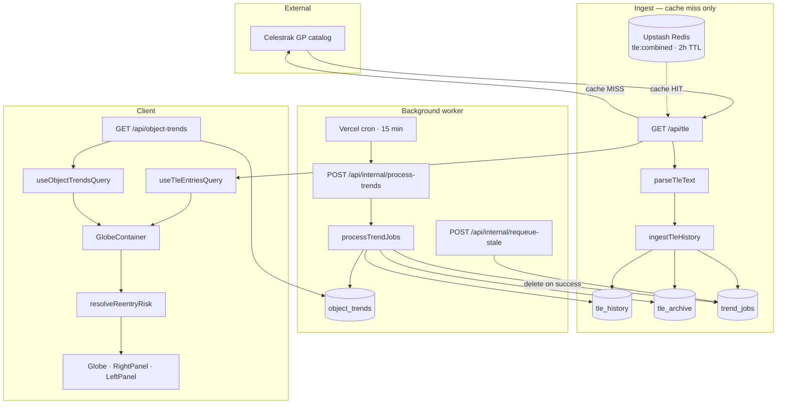
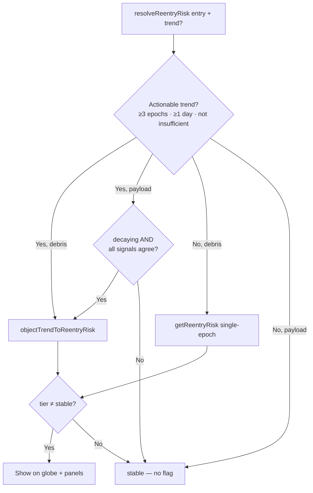

# TLE History Pipeline

## Overview

The TLE history pipeline stores successive Celestrak GP element sets in **Neon PostgreSQL**, derives per-object decay trends in the background, and feeds those trends into the globe's re-entry screening UI. It sits alongside the existing Redis-cached TLE proxy — clients still receive plain-text TLE from `/api/tle`; history ingest is a server-side side effect.

**Goals:**

- Accumulate multi-epoch orbital parameters (BSTAR, N-dot, altitude geometry) per NORAD ID
- Detect decay vs maneuvering vs stable behavior over 7/14/30-day windows
- Screen debris immediately with single-epoch fallback; screen active payloads only when multi-epoch signals agree

**Stack:** Drizzle ORM · Neon serverless HTTP driver · Upstash Redis (TLE cache only)

---

## End-to-end architecture



---

## Data flow summary

| Stage | Trigger | Input | Output |
|-------|---------|-------|--------|
| TLE fetch | Client loads globe | Celestrak groups | Plain-text TLE to client |
| Redis cache | Default groups | Combined TLE text | 2h TTL; stale key has no TTL |
| History ingest | TLE **cache miss** only | Parsed `TleEntry[]` | Rows in `tle_history` + `tle_archive`; jobs in `trend_jobs` |
| Trend worker | Cron, internal POST, or fire-and-forget after ingest | Pending `trend_jobs` | Upsert `object_trends`; delete completed jobs |
| Trends API | Re-entry toggle ON | — | JSON map of actionable trends |
| Screening | `showReentry` enabled | TLE entries + optional trends | `reentryRisks` Map → globe colors + panels |

---

## Database schema

Defined in `lib/db/schema.ts`, applied via `drizzle/0000_clever_titania.sql`.

### `tle_history` (partitioned)

Time-series of parsed orbital parameters. Partitioned monthly by `epoch` (`PARTITION BY RANGE`).

| Column | Purpose |
|--------|---------|
| `norad_id`, `epoch` | Composite unique key — one row per object per TLE epoch |
| `bstar`, `mean_motion`, `mean_motion_dot` | Core decay signals |
| `perigee_km`, `apogee_km`, `semi_major_axis_km` | Altitude geometry (derived at ingest) |
| `inclination`, `raan`, `arg_perigee`, `mean_anomaly`, `eccentricity` | Full orbital state |
| `ingested_at`, `source_group` | Provenance |

**Access pattern:** Trend worker loads last 30 days per NORAD ID, ordered by epoch.

**Partition maintenance:** Migration seeds partitions through 2026-08 plus a `DEFAULT` partition. Add new monthly partitions before the calendar catches up.

### `tle_archive`

Raw TLE name + line 1 + line 2. Write-once per `(norad_id, epoch)`. Used to recover object names for `classifyObjectType` when computing trends.

### `object_trends`

Derived cache — **one row per NORAD ID**, owned entirely by the trend worker.

| Column group | Fields |
|--------------|--------|
| Coverage | `epochs_available`, `history_days_available`, `trend_version` |
| BSTAR | `bstar_latest`, slopes 7d/14d/30d, mean/stddev/r² over 14d |
| Altitude | `perigee_*`, `apogee_*`, `sma_*` slopes |
| N-dot | `mean_motion_dot_latest`, `mean_motion_dot_mean_14d` |
| Classification | `decay_signal`, `maneuver_likelihood`, `decay_confidence` |
| Re-entry | `estimated_days_remaining`, `estimated_reentry_at`, `reentry_tier` |
| Metadata | `object_type`, `is_debris` |

`trend_version` must match `CURRENT_TREND_VERSION` in `lib/jobs/computeObjectTrends.ts` for the public API to return a row. Bump the version when the regression or confidence formula changes; stale rows are requeued automatically.

### `trend_jobs`

Ephemeral work queue. Rows are **deleted on success**, not marked done.

| Status | Meaning |
|--------|---------|
| `pending` | Waiting for worker |
| `processing` | Claimed by `FOR UPDATE SKIP LOCKED` |
| `failed` | Exhausted retries (max 3) |

Partial unique index `idx_trend_jobs_pending_norad` enforces one pending job per NORAD ID.

---

## Ingest path

**Entry point:** `app/api/tle/route.ts` → `ingestTleHistory()` in `lib/jobs/ingestTleHistory.ts`

### When ingest runs

Ingest executes **only on Redis cache miss** for the default Celestrak groups (`active`, debris groups). Cache hits return TLE immediately with **no database writes**. At steady state this means at most one ingest cycle per 2 hours.

After a successful ingest, `processTrendJobs(100)` is fired in the background (non-blocking).

### Ingest algorithm

1. Validate each `TleEntry` (finite epoch, positive mean motion)
2. Insert into `tle_history` with `onConflictDoNothing` on `(norad_id, epoch)`
3. Archive raw TLE lines only for **newly inserted** epochs
4. Enqueue `trend_jobs` for NORAD IDs that received a new epoch (`onConflictDoNothing` on pending duplicate)

Returns `{ inserted, skipped, invalid }`:

- **inserted** — new epoch rows written
- **skipped** — epoch already in DB (same Celestrak publish)
- **invalid** — failed validation

### Parsed fields

`lib/tle.ts` → `parseTleText()` combines name lines with `parseTLEMeta()` from `lib/satelliteHelpers.ts`. Geometry (`perigeeKm`, `semiMajorAxisKm`, etc.) is computed once at ingest and never recomputed in the worker.

---

## Trend worker

**Entry points:**

| Route | Auth | Action |
|-------|------|--------|
| `POST /api/internal/process-trends` | `x-internal-secret` or `Authorization: Bearer $CRON_SECRET` | Drain pending jobs |
| `GET /api/internal/process-trends` | Same | Vercel cron handler |
| `POST /api/internal/requeue-stale` | `x-internal-secret` | Re-enqueue rows where `trend_version < CURRENT` |

**Vercel cron:** `vercel.json` — every 15 minutes.

### Job processing (`processTrendJobs`)

1. Claim up to `batchSize` pending jobs with `FOR UPDATE SKIP LOCKED`
2. For each NORAD ID, run `recomputeTrends()`
3. Delete successful jobs; retry failures up to 3 times

### `recomputeTrends` algorithm

1. Load `tle_history` rows for the last **30 days**
2. If fewer than **3 epochs** or less than **1 day** span → write `decay_signal: insufficient_data`, `reentry_tier: stable`
3. Run linear regression over 7/14/30-day windows for BSTAR, perigee, apogee, SMA, N-dot
4. `classifyDecaySignal()` → decay confidence from weighted signals, reduced by maneuver likelihood:

   ```
   raw = 0.35 × BSTAR + 0.25 × N-dot + 0.40 × altitude
   decayConfidence = raw × (1 − maneuverLikelihood × 0.75)
   ```

5. `estimateReentry()` → days remaining from perigee/SMA negative slopes; payloads require **all three signals** to agree before assigning a non-stable tier
6. Upsert `object_trends`

### Decay signals

| Signal | Condition |
|--------|-----------|
| `maneuvering` | High BSTAR coefficient of variation without altitude decay |
| `decaying` | `decayConfidence ≥ 0.35` and altitude or joint BSTAR+N-dot agreement |
| `stable` | Low confidence with ≥5 epochs |
| `insufficient_data` | Default when history is too thin |

---

## Public API

### `GET /api/object-trends`

Read-only. Returns trends where:

- `trend_version === CURRENT_TREND_VERSION`
- `decay_signal !== 'insufficient_data'`

Does **not** run the worker (keeps response fast for the UI).

Response shape:

```json
{
  "trendVersion": 3,
  "trends": [ { "noradId": 12345, "decaySignal": "decaying", ... } ]
}
```

### `GET /api/tle`

Unchanged client contract — plain-text combined TLE. History ingest is a side effect on cache miss.

---

## Client consumption

### Hooks

| Hook | Endpoint | When enabled |
|------|----------|--------------|
| `useTleEntriesQuery` | `/api/tle` | Always (globe load) |
| `useObjectTrendsQuery` | `/api/object-trends` | `showReentry === true` |

Trends use 30-minute stale time. `GlobeContainer` does **not** block screening on trends load — single-epoch results appear immediately; trends refine in the background.

### Hybrid re-entry resolution

`resolveReentryRisk()` in `lib/objectTrendRisk.ts`:



| Object type | Single-epoch (`getReentryRisk`) | Multi-epoch |
|-------------|--------------------------------|-------------|
| **Debris** | Allowed — BSTAR + N-dot from current TLE | When history is actionable |
| **Active payload** | **Never** — BSTAR is corrupted by maneuvers | Only when BSTAR ↑, N-dot ↑, and altitude ↓ all agree and `decay_signal === 'decaying'` |

Signal agreement helpers live in `lib/reentrySignals.ts`. Full screening physics and tier thresholds are documented in [REENTRY_RISK.md](./REENTRY_RISK.md).

### UI surfaces

| Component | Consumption |
|-----------|-------------|
| `GlobeContainer` | Builds `reentryRisks` Map via `resolveReentryRisk` |
| `useGlobeLayers` | Colors/sizes satellites by tier (ref pattern avoids layer recompute) |
| `RightPanel` | Tier counts, top-50 list, toggle |
| `LeftPanel` | Detail section for focused satellite (`source: multi_epoch` accent on Signal row) |

---

## Environment variables

| Variable | Used by |
|----------|---------|
| `DATABASE_URL` | Neon PostgreSQL (`lib/db.ts`) |
| `INTERNAL_JOB_SECRET` | Internal job routes (`x-internal-secret` header) |
| `CRON_SECRET` | Vercel cron → `Authorization: Bearer` on process-trends |
| Upstash Redis vars | TLE cache only (unchanged) |

---

## Operations

### Cold start timeline

History grows one epoch per cache-miss ingest cycle (~2h minimum interval):

| Day | Typical state |
|-----|---------------|
| 1 | ~1 epoch/object → all `insufficient_data` → debris screened via single-epoch only |
| 2 | ~2 epochs for objects with updated Celestrak elements |
| 3+ | ≥3 epochs over ≥1 day → multi-epoch trends activate |

Expect ingest logs like `{ inserted: 7178, skipped: 11131 }` on day 2 — skipped means the epoch already exists, not an error.

### Algorithm changes

1. Bump `CURRENT_TREND_VERSION` in `lib/jobs/computeObjectTrends.ts`
2. Deploy
3. Call `POST /api/internal/requeue-stale` or wait for cron — stale rows are re-enqueued and recomputed

### Manual worker drain

```bash
curl -X POST "https://<host>/api/internal/process-trends?batchSize=200" \
  -H "x-internal-secret: $INTERNAL_JOB_SECRET"
```

### Partition maintenance

Before each new month, add a partition to `tle_history`:

```sql
CREATE TABLE tle_history_2026_09
  PARTITION OF tle_history
  FOR VALUES FROM ('2026-09-01') TO ('2026-10-01');
```

---

## File index

| Path | Role |
|------|------|
| `app/api/tle/route.ts` | Celestrak proxy, Redis cache, ingest trigger |
| `app/api/object-trends/route.ts` | Public trends read API |
| `app/api/internal/process-trends/route.ts` | Worker drain (cron + manual) |
| `app/api/internal/requeue-stale/route.ts` | Version invalidation requeue |
| `lib/db.ts` | Drizzle + Neon HTTP client |
| `lib/db/schema.ts` | Table definitions |
| `lib/tle.ts` | `parseTleText`, object type classification |
| `lib/jobs/ingestTleHistory.ts` | History + archive writes, job enqueue |
| `lib/jobs/computeObjectTrends.ts` | Regression, classification, worker |
| `lib/jobs/requeueStaleObjects.ts` | Stale version sweep |
| `lib/reentrySignals.ts` | Shared signal agreement helpers |
| `lib/objectTrendRisk.ts` | `resolveReentryRisk`, trend → UI mapping |
| `lib/satelliteHelpers.ts` | Single-epoch `getReentryRisk`, BSTAR/N-dot parsers |
| `hooks/useTleEntriesQuery.ts` | Client TLE fetch |
| `hooks/useObjectTrendsQuery.ts` | Client trends fetch |
| `app/globe/GlobeContent/GlobeContainer.tsx` | Screening orchestration |
| `drizzle/0000_clever_titania.sql` | Migration (partitions, indexes) |
| `vercel.json` | Cron schedule |
| `docs/REENTRY_RISK.md` | Screening physics and tier thresholds |

---

## Related documentation

- [REENTRY_RISK.md](./REENTRY_RISK.md) — BSTAR formula, tier thresholds, anomaly guards
- [README.md](../README.md) — TLE proxy and Redis cache overview
