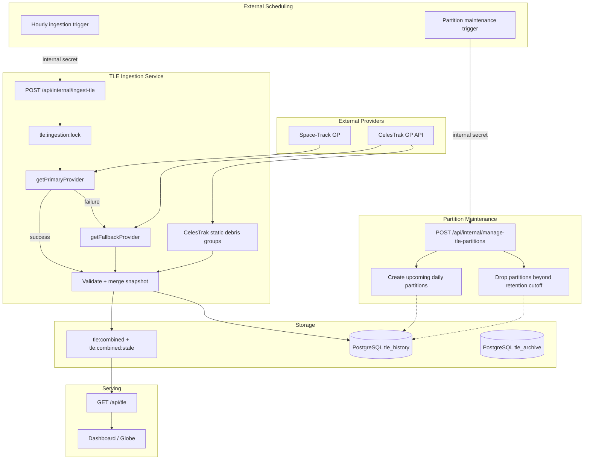

# TLE Pipeline Architecture

## 1. Purpose and scope

The DRAKON TLE pipeline acquires current two-line element data from external providers, normalizes it into a common representation, maintains a merged current catalog, and persists accepted observations to PostgreSQL for downstream orbital trend analysis.

The pipeline separates three concerns: provider acquisition, current-catalog assembly, and historical persistence. Trend regression, re-entry screening, and client-side interpretation of historical data are downstream consumers documented separately.

The current architecture is ingestion-first: `GET /api/tle` is a pure read endpoint. It no longer performs provider fetching, history writes, cache population, or shadow validation.

## 2. Architectural principles

The pipeline is built around several invariants:

- Provider failure must not replace the current catalog with an incomplete dataset.
- CelesTrak remains authoritative for the three explicitly tracked static debris clouds.
- Only an authoritative Space-Track full resynchronization may remove objects from the merged catalog.
- Provider provenance must survive into `tle_history`.
- Redis is the serving layer for the current catalog; PostgreSQL is the historical system of record.
- Ingestion is serialized because snapshot assembly is a read-modify-write operation.
- The client read path is side-effect free.
- Partition maintenance is independent from ingestion and safe to run repeatedly.
- Historical retention is enforced at the partition level rather than through large row-deletion jobs.

## 3. High-level architecture



The external scheduler is outside the application. The repository exposes authenticated internal endpoints; deployment configuration determines how frequently those endpoints are invoked.

## 4. Provider model

All providers implement the common `TLEProvider` contract in `lib/tle-providers/types.ts`. The provider result contains raw response data, provider identity, fetch timestamp, and object count. Downstream parsing and ingestion therefore remain independent of provider-specific authentication and transport details.

`lib/tle-providers/index.ts` selects primary and fallback implementations from `TLE_PROVIDER`. By default, Space-Track is primary. Setting `TLE_PROVIDER=celestrak` deliberately switches the primary source to CelesTrak and is an operational override, not an automatically entered failover state.

### 4.1 Space-Track

`lib/tle-providers/spacetrack.ts` uses Space-Track's `gp` class for payload and rocket-body data.

Authentication uses Space-Track's session-cookie flow. The `chocolatechip` cookie is cached in Redis as `spacetrack:session_cookie` with a two-hour TTL, avoiding unnecessary authentication requests during normal polling.

Normal polling uses a three-day epoch window. A full resynchronization widens the query to 45 days. The query is server-side filtered for payload and rocket-body object types and excludes records that cannot be propagated according to the provider query constraints.

The `gp` query returns the latest available element set per object rather than a historical sequence. The wider full-resync window therefore increases the chance of finding slowly refreshed objects; it does not itself create historical duplicates.

Space-Track's documented guidance for `gp` polling is treated as an operational constraint: the pipeline should not poll this class more frequently than once per hour. The codebase does not implement an independent distributed rate limiter; the external scheduler controls endpoint frequency.

Space-Track `format/3le` can include a literal `0 ` prefix on the name line. The common parser strips that provider-specific marker so downstream code receives the same logical TLE representation regardless of provider.

### 4.2 CelesTrak

`lib/tle-providers/celestrak.ts` uses CelesTrak's GP endpoint for named groups.

Requests are made sequentially with a delay between groups to respect provider rate limits. Response content is validated rather than trusting HTTP status alone because CelesTrak can return HTTP 200 with an invalid-query or no-data message.

CelesTrak has two roles:

- fallback provider for the primary payload/rocket-body catalog when Space-Track fails;
- mandatory provider for the three tracked static debris clouds.

The debris groups are fetched independently so each can be health-checked before a cycle is allowed to perform authoritative pruning.

### 4.3 Mock provider

`lib/tle-providers/mock.ts` supplies deterministic fixtures for tests and does not contact external services. Its fixtures include a normal catalog identifier and an Alpha-5 catalog number so parsing and ingestion can be tested against newer catalog-number formats.

## 5. Ingestion lifecycle

`runIngestionCycle()` in `lib/ingestion/tleIngestionService.ts` is invoked through `POST /api/internal/ingest-tle`.

A cycle performs the following operations:

1. Acquire `tle:ingestion:lock` in Redis. The lock has a 120-second TTL and is released in a `finally` block.
2. Determine whether the 24-hour full-resync interval has elapsed.
3. Fetch the configured primary provider, passing the full-resync flag when applicable.
4. If the primary request fails, invoke the fallback provider using the `active` group and record that fallback was used.
5. Fetch Iridium 33 debris, Cosmos 2251 debris, and Fengyun-1C debris from CelesTrak independently, regardless of which primary path succeeded.
6. Read and normalize the existing `tle:combined` snapshot.
7. Determine whether the cycle is eligible to prune objects from the existing snapshot.
8. Merge fresh primary and debris entries by NORAD catalog number.
9. Write the merged snapshot to both live and stale Redis keys.
10. Persist primary and debris observations to `tle_history` through separate ingestion calls so source provenance remains distinct.
11. Release the Redis lock.

The cycle returns a summary containing lock-skipped state, provider used, full-resync state, resulting snapshot size, and history-ingestion counters.

## 6. Snapshot assembly and pruning policy

The current snapshot is maintained as a merge, not an unconditional replacement. Provider responses are not guaranteed to represent the entire catalog on every request, so a partial response must not erase previously known objects.

Pruning is a privileged operation. All of the following conditions must hold before objects can be removed:

- a full resynchronization is due;
- Space-Track was actually used as the primary provider;
- no unplanned fallback occurred;
- every static debris group individually passed its configured health floor.

When eligible, the existing snapshot is pruned only for objects absent from both the fresh primary response and the current debris response.

A CelesTrak fallback can populate or refresh the catalog but can never authorize deletion. Likewise, setting `TLE_PROVIDER=celestrak` disables Space-Track-specific pruning authority for that cycle.

This distinction prevents a narrower provider response from being interpreted as authoritative catalog deletion.

## 7. Static debris handling

The following CelesTrak groups are fetched on every ingestion cycle:

- `iridium-33-debris`
- `cosmos-2251-debris`
- `fengyun-1c-debris`

They are fetched separately, and each group has an independent minimum-health check represented by `DEBRIS_GROUP_MIN_HEALTHY`.

The health check is deliberately per group. A combined population threshold could allow a complete outage of the smallest group to be hidden by the much larger populations of the other two groups.

Membership in these groups is determined from the current provider fetch, not from `TleEntry.isDebris`. The latter is a classification heuristic and is not a reliable representation of source membership.

## 8. Current catalog storage in Redis

Two Redis keys represent the assembled TLE catalog:

| Key | Lifetime | Purpose |
| --- | --- | --- |
| `tle:combined` | 2 hours | Live serving snapshot and dead-man's-switch for ingestion freshness |
| `tle:combined:stale` | No TTL | Last successfully assembled snapshot used as an emergency read fallback |

Both keys are written during every successful ingestion cycle.

The two-hour TTL on `tle:combined` is not itself the freshness model. The ingestion service rewrites the key every cycle. Its expiry acts as a dead-man's switch: if ingestion stops long enough for the live key to expire, the application can detect that current ingestion is unhealthy instead of indefinitely presenting an apparently live cache.

`tle:combined:stale` deliberately has no TTL so a temporary ingestion outage does not immediately destroy the last known catalog.

Additional Redis state includes:

| Key | TTL | Purpose |
| --- | --- | --- |
| `spacetrack:session_cookie` | 2 hours | Cached Space-Track authentication session |
| `tle:last_full_resync` | none | Timestamp used to determine whether a full resync is due |
| `tle:ingestion:lock` | 120 seconds | Prevents concurrent ingestion cycles |

## 9. Client read path

`GET /api/tle` is intentionally a pure read endpoint.

```text
Redis tle:combined
       |
       +-- present --> return current snapshot (x-cache: HIT)
       |
       +-- missing --> Redis tle:combined:stale
                          |
                          +-- present --> return stale snapshot (x-cache: STALE)
                          |
                          +-- missing --> HTTP 503
```

The endpoint does not contact either provider, populate Redis, write `tle_history`, perform provider comparison, or perform shadow validation.

It normalizes Redis newline encoding before returning TLE text. This prevents serialized Redis data from being interpreted as malformed TLE records.

Returning HTTP 503 when both snapshots are absent is intentional: an empty successful catalog would be indistinguishable from a legitimate zero-object response.

## 10. PostgreSQL historical persistence

Accepted TLE observations are stored in PostgreSQL `tle_history`.

The parent table contains the NORAD ID, TLE epoch, BSTAR, mean motion, mean-motion derivative, eccentricity, inclination, RAAN, argument of perigee, mean anomaly, perigee altitude, apogee altitude, semi-major axis, ingestion timestamp, and `source_group`.

Orbital geometry is derived at ingestion time and persisted. Downstream trend computation therefore consumes normalized historical records rather than repeatedly parsing raw TLE lines.

The primary historical access index is `(norad_id, epoch)`. A separate index on `ingested_at` supports recent-ingestion sweeps. A uniqueness constraint on `(norad_id, epoch)` prevents repeated observations of the same orbital epoch from creating duplicates.

### 10.1 Source provenance

History ingestion is deliberately split into two calls:

- primary catalog entries use the provider actually used for the primary fetch (`spacetrack` or `celestrak`);
- static debris entries use `celestrak:debris`.

This prevents mixed provider batches from being stored as though they came entirely from one source.

## 11. Raw TLE archive

`tle_archive` stores raw TLE data for point lookup and provenance. It contains NORAD ID, epoch, object name, TLE line 1, TLE line 2, and storage timestamp.

`(norad_id, epoch)` is unique. The archive is not the primary source for regression; `tle_history` stores normalized orbital fields specifically so analytics do not have to repeatedly parse raw TLE text.

## 12. Partitioning strategy

`tle_history` is range-partitioned by the `epoch` column. The implementation is maintained by `lib/db/tlePartitions.ts`.

The system is currently transitioning from legacy monthly partitions to daily partitions. The migration is intentionally incremental rather than rewriting historical rows solely to change partition granularity.

### 12.1 Daily partitions

The daily-partition cutover is explicitly configured for September 1, 2026. Starting at that boundary, maintenance creates one UTC-calendar-day partition using:

```text
tle_history_YYYY_MM_DD
```

Each partition represents a half-open UTC range:

```text
FROM 'YYYY-MM-DD' TO 'YYYY-MM-DD + 1 day'
```

`ensureUpcomingPartitions()` creates the current day plus seven additional days of forward buffer, for eight daily partitions in total. The forward buffer reduces the chance that ingestion reaches a new UTC day before its PostgreSQL partition exists.

### 12.2 Legacy monthly partitions

The maintenance code still recognizes:

```text
tle_history_YYYY_MM
```

because the August 2026 data is already owned by the legacy `tle_history_2026_08` partition.

The cleanup logic understands both daily and monthly naming schemes and evaluates the actual date range represented by each partition before dropping it. This allows the migration to retire legacy monthly partitions naturally without requiring a historical rewrite.

### 12.3 Cutover behavior

`DAILY_CUTOVER_MS` is an explicit September 1, 2026 boundary. `ensureUpcomingPartitions()` starts at the later of the current UTC day and this cutover date. Consequently, maintenance will not attempt to create daily partitions over the August monthly range.

This explicit cutover is important because PostgreSQL cannot have overlapping partition bounds under the same parent table.

### 12.4 Partition cleanup

`dropStalePartitions()` discovers child partitions dynamically through PostgreSQL's `pg_inherits` catalog rather than relying on a hardcoded partition list.

A partition is dropped when its entire range ends at or before:

```text
now - 35 days
```

The 35-day boundary corresponds to the downstream 30-day trend-analysis window plus a five-day safety margin.

Daily and legacy monthly partitions are parsed separately. Unknown child relations are ignored, which protects `tle_history_default` and unexpected relations from accidental deletion.

Dropping a complete partition removes its relation and avoids the table-wide bloat and vacuum behavior associated with repeatedly deleting large volumes of historical rows.

## 13. Partition-maintenance endpoint

`POST /api/internal/manage-tle-partitions` invokes `runPartitionMaintenance()`.

The endpoint requires `x-internal-secret` to match `INTERNAL_JOB_SECRET` and has a 60-second maximum execution duration.

The sequence is:

```text
ensureUpcomingPartitions()
          |
          v
create missing daily partitions
          |
          v
dropStalePartitions()
          |
          v
drop ranges older than 35 days
```

Both operations are idempotent. Repeated execution does not recreate existing partitions or affect partitions still inside the retention window.

The endpoint is intended to be invoked externally; it does not define its own cron schedule.

## 14. Full resynchronization

A full resynchronization is a logical ingestion mode, not a separate endpoint.

`FULL_RESYNC_INTERVAL_MS` is 24 hours. Normal ingestion can therefore occur more frequently while only one cycle per 24-hour period is eligible for authoritative pruning.

The Space-Track provider widens its query window from three days to 45 days for a full resync. This compensates for objects whose latest element set may not have been refreshed recently.

The last full-resync timestamp is stored in `tle:last_full_resync`.

A full-resync flag alone is insufficient to permit deletion; the provider, fallback, and debris-health conditions must also be satisfied.

## 15. Concurrency and failure isolation

### Ingestion lock

`tle:ingestion:lock` serializes the complete snapshot read-modify-write sequence. Without it, simultaneous cycles could read the same old snapshot, merge different responses, and race to write final state.

The 120-second expiry provides recovery if an execution is abandoned.

### Provider failure

If Space-Track fails, CelesTrak is used for the primary catalog fallback. Static debris fetching remains independent.

A fallback cycle can refresh the catalog but cannot prune it.

### Redis failure

The ingestion service depends on Redis for locking and current-snapshot assembly. Redis unavailability is therefore treated as an ingestion failure rather than attempting an unsafe stateless replacement.

### PostgreSQL failure

Current-catalog serving and historical persistence are logically separated. A database failure can prevent new history rows from being stored even when the Redis snapshot has been assembled. Trend freshness then degrades independently from current catalog availability.

### Read-path failure

If the live Redis key is absent, the read path serves the permanent stale snapshot. If neither exists, it returns 503 instead of fabricating an empty catalog.

## 16. Operational data flow

```text
External scheduler
       |
       v
POST /api/internal/ingest-tle
       |
       v
Acquire Redis lock
       |
       +----------------------+
       |                      |
       v                      v
Space-Track primary      CelesTrak debris groups
       |                      |
       | failure              |
       v                      |
CelesTrak fallback            |
       |                      |
       +----------+-----------+
                  |
                  v
          Validate + normalize
                  |
                  v
       Read existing Redis snapshot
                  |
                  v
       Authoritative prune check
                  |
                  v
         Merge by NORAD ID
             /         \
            v           v
     Redis snapshot   PostgreSQL history
            |
            v
       GET /api/tle
            |
            v
       Dashboard / Globe
```

Historical rows then feed the downstream trend pipeline:

```text
tle_history
     |
     v
trend job queue
     |
     v
historical regression
     |
     v
object_trends
     |
     +--> re-entry screening
     +--> decision trace
     +--> trend / history UI
```

## 17. Freshness model

The pipeline has several distinct freshness dimensions.

**Provider freshness** is determined by the age of the latest provider element set and the provider query window.

**Redis snapshot freshness** is controlled operationally by the ingestion schedule and the two-hour live-key TTL. The TTL is a failure detector, not a guarantee that every TLE in the snapshot is less than two hours old.

**Historical freshness** depends on when an object's latest accepted epoch was persisted to `tle_history`.

**Trend freshness** is downstream and depends on the trend worker processing jobs created from historical ingestion.

A current Redis snapshot can therefore contain an object whose latest TLE is older than the latest ingestion cycle, while a current TLE can exist before its corresponding trend result has been recomputed. These are expected asynchronous states.

## 18. Performance characteristics

Provider acquisition occurs only in the internal ingestion endpoint, so client requests do not incur provider latency or external API rate-limit cost.

The Space-Track query uses server-side predicates rather than a large sequence of NORAD-ID requests, reducing network round trips and serverless execution overhead.

Historical ingestion uses conflict-safe epoch insertion so repeated observations do not inflate history with duplicates.

Partition-level retention removes complete date ranges instead of issuing large deletes against the historical parent table, keeping the historical store bounded with substantially less table bloat.

The current snapshot is a single Redis payload, allowing the dashboard and globe to load the catalog without issuing one query per object.

## 19. Data-integrity safeguards

The major safeguards are:

- provider response-content validation;
- provider abstraction and explicit provenance;
- Redis ingestion locking;
- merge-not-replace snapshot semantics;
- authoritative-pruning gates;
- independent health checks for all static debris groups;
- unique `(norad_id, epoch)` historical observations;
- newline normalization before parsing Redis snapshots;
- permanent stale-cache fallback;
- partition cleanup based on actual PostgreSQL child relations;
- recognition of both legacy monthly and current daily partition naming schemes;
- seven-day daily forward buffer;
- 35-day retention cutoff around the downstream 30-day trend window.

These safeguards address different failure classes and should be treated as independent invariants.

## 20. Migration state and compatibility

The daily-partition migration is non-destructive to the existing monthly partition during the transition.

The explicit September 1, 2026 cutover means August data remains under `tle_history_2026_08`, while new daily ranges are created from the cutover onward. The maintenance code can inspect and retire either naming scheme based on its actual range.

No historical row rewrite is required merely to introduce daily partitioning. The existing monthly partition remains until its complete range falls outside the 35-day retention boundary.

## 21. Known limitations

- Provider polling frequency is externally scheduled rather than enforced by an internal distributed rate limiter.
- Space-Track `gp` supplies the latest element set rather than a complete historical sequence, so historical density comes from repeated ingestion cycles.
- CelesTrak's fallback catalog is narrower than the Space-Track primary catalog and cannot be used as an authoritative deletion source.
- Redis is the current-catalog serving layer, so current TLE availability depends on successful ingestion into Redis.
- The stale Redis key can preserve an old catalog indefinitely if ingestion remains broken; consumers must distinguish stale availability from current freshness.
- Partition maintenance is externally scheduled.
- The daily-partition transition temporarily permits both daily and legacy monthly partitions to coexist.

## 22. Engineering invariants

Changes to this pipeline should preserve the following:

1. `GET /api/tle` remains a pure read path.
2. Current snapshots are merged by NORAD ID rather than blindly replaced.
3. CelesTrak fallback data can refresh the catalog but cannot authorize pruning.
4. Only an un-fallbacked Space-Track full resync with healthy debris feeds can authorize catalog deletion.
5. Static debris feeds remain independently health-checked.
6. `tle_history.source_group` preserves provider provenance.
7. `(norad_id, epoch)` remains unique in historical storage.
8. The ingestion lock covers the complete snapshot read-modify-write sequence.
9. `tle:combined:stale` remains independent of the live-key TTL.
10. Partition maintenance must support both legacy monthly and current daily partitions during migration.
11. The retention boundary remains compatible with the downstream 30-day trend-analysis window.
12. The daily forward buffer must prevent normal ingestion from reaching an unpartitioned future UTC date.
13. Unknown child relations discovered through `pg_inherits` must not be dropped by cleanup.
14. Provider-specific wire-format quirks are normalized at the parser/provider boundary.

## 23. Key implementation files

| Responsibility | Implementation |
| --- | --- |
| Provider contract | `lib/tle-providers/types.ts` |
| Provider selection | `lib/tle-providers/index.ts` |
| Space-Track provider | `lib/tle-providers/spacetrack.ts` |
| CelesTrak provider | `lib/tle-providers/celestrak.ts` |
| Mock provider | `lib/tle-providers/mock.ts` |
| TLE parser / normalization | `lib/tle.ts` |
| Ingestion orchestration | `lib/ingestion/tleIngestionService.ts` |
| TLE read endpoint | `app/api/tle/route.ts` |
| Ingestion endpoint | `app/api/internal/ingest-tle/route.ts` |
| Partition maintenance | `lib/db/tlePartitions.ts` |
| Partition endpoint | `app/api/internal/manage-tle-partitions/route.ts` |
| Database schema | `lib/db/schema.ts` |
| Historical ingestion | `lib/jobs/ingestTleHistory.ts` |
| Historical trend worker | `lib/jobs/computeObjectTrends.ts` |

## 24. Related documentation

- [TLE History Pipeline](./TLE_HISTORY_PIPELINE.md) — historical processing, trend computation, and derived storage.
- [Re-entry Risk](./REENTRY_RISK.md) — screening architecture and final risk resolution.
- [Collision Density Map](./COLLISION_DENSITY_MAP.md)
- [Orbital Plane Visualization](./ORBITAL_PLANE_VISUALIZATION.md)
