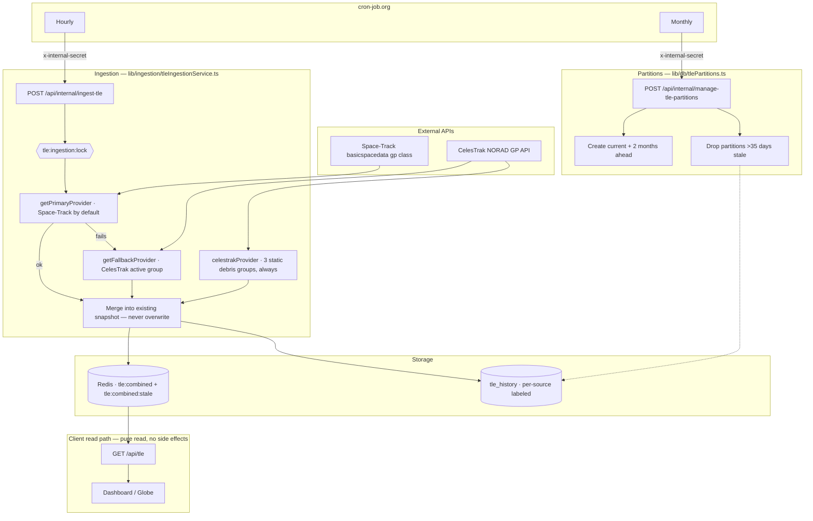

# TLE Pipeline Architecture

## Overview

This covers **how TLE data gets fetched and into the combined snapshot and `tle_history`** — the provider layer, the ingestion service, and partition maintenance. For what happens to that data afterward (trend computation, screening, the client-facing read path in detail), see [TLE_HISTORY_PIPELINE.md](./TLE_HISTORY_PIPELINE.md).

Originally this was CelesTrak-only: `GET /api/tle` fetched four named groups on a Redis cache miss and that was the entire data source. That has a structural limit CelesTrak can't fix — its public groups (like `active`) are a **curated subset**, not the full catalog, so objects that are still in orbit but not in that curation never show up. Space-Track's own `gp` class query is the underlying catalog those groups are drawn from, with a real-time curation lag CelesTrak's public files don't have.

The pipeline now pulls from **both**, behind a common interface, with CelesTrak never fully retired:

- **Space-Track** — primary source, broader payload + rocket-body catalog
- **CelesTrak** — always the source for the three static debris clouds (Space-Track's `gp` class isn't a good fit for tracking specific debris-collision fragments the same way), and the automatic fallback if Space-Track's auth or query fails

**Stack:** same as [TLE_HISTORY_PIPELINE.md](./TLE_HISTORY_PIPELINE.md) — Drizzle ORM · Neon serverless HTTP driver · Upstash Redis — plus Space-Track's session-cookie auth.

Full design rationale, the rollout phases, and a running incident log live in `DRAKON-SpaceTrack-migration.md` at the repo root. This doc is the "how it works now" reference; that one is the "why, and what happened" history.

---

## Architecture



**`GET /api/tle` is a pure read path, as of Phase 4 (2026-07-26).** It reads `tle:combined` from Redis, falls back to the permanent `tle:combined:stale` key if that's empty, and returns `503` if both are empty (only possible on a fresh deploy before the first ingestion cycle, or an actual Redis data-loss event) — it does not fetch from CelesTrak, write to Redis, call `ingestTleHistory`, or run any shadow diff anymore. That was all pre-migration behavior, deliberately kept alive through Phases 1-3 as a safety net while the new pipeline proved itself; it's proven itself, so it's gone now. `logSpaceTrackShadowDiff`/`shadowDiff.ts` was removed entirely in the same cleanup — its only job was validating Space-Track before trusting it as primary, and it had no remaining caller once this route stopped fetching on its own.

---

## Provider interface

`lib/tle-providers/types.ts` — every provider implements the same contract, so nothing downstream (parsing, ingestion, history writes) knows or cares which one produced a given fetch:

```typescript
interface TLEProvider {
  readonly name: 'celestrak' | 'spacetrack' | 'mock';
  fetch(options?: TleFetchOptions): Promise<TleFetchResult>;
}

interface TleFetchOptions {
  groups?: string[]; // CelesTrak-style named groups; ignored by Space-Track
  fullResync?: boolean; // widen the query window enough to prune from
  format?: 'tle' | '3le'; // always request '3le' explicitly — see below
}

interface TleFetchResult {
  raw: string;
  provider: ProviderName;
  fetchedAt: Date;
  objectCount: number;
}
```

| Provider             | File                              | Role                                                                                       |
| -------------------- | --------------------------------- | ------------------------------------------------------------------------------------------ |
| `celestrakProvider`  | `lib/tle-providers/celestrak.ts`  | Static debris clouds (always), fallback for payload/rocket-body scope (on primary failure) |
| `spacetrackProvider` | `lib/tle-providers/spacetrack.ts` | Primary source for payload + rocket-body objects                                           |
| `mockProvider`       | `lib/tle-providers/mock.ts`       | Deterministic fixture (includes one Alpha-5 object) for tests — no live network needed     |

`lib/tle-providers/index.ts` exports `getPrimaryProvider()`/`getFallbackProvider()`, keyed off `TLE_PROVIDER`: unset (or anything other than the literal string `celestrak`) means Space-Track primary, CelesTrak fallback. Set `TLE_PROVIDER=celestrak` to flip it — useful for an incident response if Space-Track itself is having problems, though nothing in this pipeline does that automatically.

### CelesTrak provider

Fetches named groups from `celestrak.org/NORAD/elements/gp.php`, one at a time with a 1.1s delay between requests to respect CelesTrak's rate limits. Validates content rather than trusting HTTP status alone — CelesTrak returns `200 OK` with an error message body for invalid/discontinued groups, so the response text is checked for `Invalid query`/`No GP data` and for actual `1 `/`2 ` TLE-format lines before accepting it.

### Space-Track provider

Session-cookie auth, not an API key. `POST /ajaxauth/login` sets a cookie literally named `chocolatechip` (confirmed against Space-Track's own docs — not a typo); the cookie is cached in Redis (`spacetrack:session_cookie`, 2h TTL, since Space-Track doesn't publish an exact idle timeout) so most hourly cycles reuse it instead of re-authenticating every call.

Query is scoped by predicate, not by a chunked `NORAD_CAT_ID` list — `OBJECT_TYPE/PAYLOAD,ROCKET BODY` plus `decay_date/null-val` (Space-Track's own recommendation for skipping objects that can't be propagated) lets Space-Track filter server-side in one request, rather than ~38 sequential ~500-object batches risking Vercel's timeout. The epoch window widens from 3 days (normal poll) to 45 days (`fullResync`) — the `gp` class returns exactly one row per object (the latest elset, not a history), so a wider window just catches more slow-to-refresh objects, never duplicates.

**Rate limit:** poll `gp` data once per hour, full stop — this is Space-Track's own documented guidance for this specific class (distinct from, and stricter than, the general 30/min–300/hour throttle), with an explicit account-suspension warning attached. Nothing in this codebase enforces that on its own; it's enforced by how often `/api/internal/ingest-tle` actually gets triggered externally (cron-job.org).

**The name-line format quirk:** Space-Track's `format/3le` output includes a literal `"0 "` line-type marker on the name line — the strict 3LE spec's line-0 indicator — which CelesTrak's `FORMAT=3le` omits. `parseTleText` (`lib/tle.ts`) strips it when present, provider-agnostic either way. Confirmed in production 2026-07-25 after names started showing up as e.g. `"0 CALSPHERE 1"` in the UI and in Redis; regression-tested.

### Mock provider

Returns a fixed two-object fixture (one standard name, one Alpha-5 catalog number) — used by tests that need a provider without hitting either live API.

---

## Ingestion service

`lib/ingestion/tleIngestionService.ts` — `runIngestionCycle()`, triggered by `POST /api/internal/ingest-tle`. One cycle:

1. **Acquire a Redis lock** (`tle:ingestion:lock`, 120s TTL) so an overlapping trigger can't race the read-modify-write merge below.
2. **Fetch primary** (`getPrimaryProvider()`, passing `fullResync` if one is due). On failure, fall back to `getFallbackProvider()` with `groups: ['active']` and mark `usedFallback`.
3. **Always fetch the three static debris clouds** from `celestrakProvider` separately, regardless of how step 2 went.
4. **Read the existing `tle:combined` snapshot** (with the same Upstash newline-unescaping fix the read path uses — this read didn't exist before the ingestion service, and skipping the fix here would make `parseTleText` silently return zero entries for the existing snapshot, turning "merge" into "overwrite" every cycle).
5. **If this is a full resync AND not a fallback cycle:** prune snapshot entries that are missing from _both_ this cycle's fresh fetch and the debris fetch. A CelesTrak fallback result is never treated as authoritative enough to prune from — that would reintroduce the exact curation-lag gap this migration exists to close. Only an authoritative Space-Track sweep can drop objects.
6. **Merge** (never replace) fresh primary + debris entries into the snapshot map, keyed by NORAD ID.
7. **Write** the merged snapshot back to both `tle:combined` (2h TTL) and `tle:combined:stale` (no TTL).
8. **Ingest history in two separate calls** — primary entries labeled with the actual provider used (`spacetrack` or `celestrak`), debris entries labeled `celestrak:debris` — so `tle_history.source_group` never mislabels a mixed batch.
9. **Release the lock** (in a `finally`, so it releases even on error).

| Constant                             | Value | Why                                                                                       |
| ------------------------------------ | ----- | ----------------------------------------------------------------------------------------- |
| `FULL_RESYNC_INTERVAL_MS`            | 24h   | How often a full (prune-eligible) resync runs, independent of ingestion trigger frequency |
| `LOCK_TTL_SECONDS`                   | 120   | Generous vs. an expected ~5–15s cycle                                                     |
| `HOURLY_WINDOW_DAYS` (spacetrack.ts) | 3     | Normal poll window                                                                        |
| `RESYNC_WINDOW_DAYS` (spacetrack.ts) | 45    | Full-resync window                                                                        |

**Debris pruning exemption** is by _fetch membership this cycle_ (`debrisIds = new Set(debrisEntries.map(e => e.id))`), never by `TleEntry.isDebris` — that field is a name-pattern heuristic for UI/screening purposes, not a data-source marker, and conflating the two was an early-draft mistake caught before it shipped.

Returns either `{ skipped: true }` (lock contention) or:

```typescript
interface IngestionCycleSummary {
  skipped: false;
  provider: string; // 'spacetrack' | 'celestrak' | 'celestrak (fallback)'
  fullResync: boolean;
  snapshotSize: number;
  inserted: number;
  skippedRows: number;
  invalid: number;
}
```

---

## Routes

| Route                                      | Auth                | Trigger                                                  | Action                                                                                                                                                              |
| ------------------------------------------ | ------------------- | -------------------------------------------------------- | ------------------------------------------------------------------------------------------------------------------------------------------------------------------- |
| `POST /api/internal/ingest-tle`            | `x-internal-secret` | cron-job.org, target hourly (Space-Track's own guidance) | One `runIngestionCycle()`                                                                                                                                           |
| `POST /api/internal/manage-tle-partitions` | `x-internal-secret` | cron-job.org, monthly                                    | Create upcoming `tle_history` partitions + drop stale ones — see below                                                                                              |
| `GET /api/tle`                             | none                | Client (globe load)                                      | Pure read: serves `tle:combined` from Redis, falling back to permanent `tle:combined:stale` if empty, `503` if both are empty. No fetch, no write, no side effects. |

---

## Redis keys

| Key                         | TTL  | Written by                                                        | Purpose                                                                                                                                                                                                                                            |
| --------------------------- | ---- | ----------------------------------------------------------------- | -------------------------------------------------------------------------------------------------------------------------------------------------------------------------------------------------------------------------------------------------- |
| `tle:combined`              | 2h   | Ingestion service (every cycle); `GET /api/tle`'s legacy fallback | The live snapshot. TTL is a dead-man's-switch, not a freshness check — the ingestion service overwrites it every cycle regardless of TTL; if it ever expires, that's the signal the pipeline stopped, and `GET /api/tle`'s own fallback self-heals |
| `tle:combined:stale`        | none | Same as above                                                     | Last-resort fallback for when _both_ ingestion is down and a live `GET /api/tle` refetch also fails (e.g. CelesTrak itself unreachable)                                                                                                            |
| `spacetrack:session_cookie` | 2h   | `spacetrack.ts`                                                   | Cached auth cookie, avoids re-authenticating every cycle                                                                                                                                                                                           |
| `tle:last_full_resync`      | none | Ingestion service                                                 | Timestamp of the last full (prune-eligible) resync                                                                                                                                                                                                 |
| `tle:ingestion:lock`        | 120s | Ingestion service                                                 | Prevents overlapping ingestion cycles                                                                                                                                                                                                              |

---

## Partition maintenance

`lib/db/tlePartitions.ts`, via `POST /api/internal/manage-tle-partitions`:

- **`ensureUpcomingPartitions`** — creates the current month + 2 months of forward buffer (`CREATE TABLE IF NOT EXISTS ... PARTITION OF`), idempotent. The initial migration (`drizzle/0000_clever_titania.sql`) hand-created three months once; nothing created any since, which is what this route now automates.
- **`dropStalePartitions`** — discovers actual partitions dynamically via `pg_inherits` (never a hardcoded list, so it never touches `tle_history_default`), and drops any whose entire date range is more than 35 days stale (`computeObjectTrends.ts`'s 30-day trend window + a safety margin).

Both operations are cheap and metadata-only (`CREATE TABLE IF NOT EXISTS` / `DROP TABLE IF EXISTS` on a range partition) — no `VACUUM` needed, unlike reclaiming space from rows deleted out of a non-partitioned table.

---

## Environment variables

| Variable              | Used by                                                                                         |
| --------------------- | ----------------------------------------------------------------------------------------------- |
| `SPACETRACK_IDENTITY` | Space-Track account email                                                                       |
| `SPACETRACK_PASSWORD` | Space-Track account password                                                                    |
| `TLE_PROVIDER`        | `celestrak` to force CelesTrak primary; anything else (including unset) defaults to Space-Track |
| `INTERNAL_JOB_SECRET` | All internal routes, including the two added here — `x-internal-secret` header                  |

---

## Operational history

A few things worth knowing happened in production that testing alone wouldn't have caught:

- **The `"0 "` name-line bug** (2026-07-25) — see the Space-Track provider section above. Fixed in `parseTleText`, regression-tested.
- **Neon's 5GB/month network-transfer allowance, not storage, was the near-term risk during cutover** — the migration's first full-resync queued a large one-time `trend_jobs` backlog (~8,600 jobs from ~16,000 newly-inserted history rows), and `processTrendJobs`'s own cron drained it independently of ingestion cadence. Throttling ingestion frequency didn't meaningfully slow this down; throttling the trends cron did. Worth remembering as a separate lever from ingestion cadence if a similarly large backlog ever gets created again (e.g. a deliberate future re-cutover).
- **The two-key Redis cache design (`tle:combined` / `tle:combined:stale`) still serves genuinely different purposes** even after the switch to a merge-based ingestion service — this was reconsidered explicitly during the migration and kept as-is; see the Redis keys table above for what each one is actually for.
- **Phase 4 cleanup (2026-07-26)** removed `GET /api/tle`'s CelesTrak-fetch-on-miss fallback and `shadowDiff.ts` entirely, once the new pipeline had run cleanly long enough to trust as the sole ingestion path. The one thing deliberately _not_ touched: `f107`/`solarFluxMultiplier` response headers (`solarFluxResponseHeaders()`) — unrelated to any of the CelesTrak/Space-Track cleanup, and `hooks/useTleEntriesQuery.ts` depends on reading them off every `/api/tle` response regardless.

Full narrative, including the rollout phase-by-phase reasoning and every fixed mistake, is in `DRAKON-SpaceTrack-migration.md`.

---

## File index

| Path                                              | Role                                                                                      |
| ------------------------------------------------- | ----------------------------------------------------------------------------------------- |
| `lib/tle-providers/types.ts`                      | `TLEProvider` interface, `TleFetchOptions`/`TleFetchResult`                               |
| `lib/tle-providers/celestrak.ts`                  | CelesTrak provider — debris (always) + fallback                                           |
| `lib/tle-providers/spacetrack.ts`                 | Space-Track provider — auth, query construction                                           |
| `lib/tle-providers/mock.ts`                       | Test fixture provider                                                                     |
| `lib/tle-providers/index.ts`                      | `getPrimaryProvider()`/`getFallbackProvider()`, keyed off `TLE_PROVIDER`                  |
| `lib/tleCache.ts`                                 | Shared `CACHE_KEY`/`STALE_CACHE_KEY`/`CACHE_TTL_SECONDS` + `normalizeNewlines`            |
| `lib/ingestion/tleIngestionService.ts`            | `runIngestionCycle()` — the merge/prune/provenance algorithm                              |
| `lib/db/tlePartitions.ts`                         | `ensureUpcomingPartitions()` / `dropStalePartitions()`                                    |
| `app/api/internal/ingest-tle/route.ts`            | Hourly ingestion trigger                                                                  |
| `app/api/internal/manage-tle-partitions/route.ts` | Monthly partition maintenance trigger                                                     |
| `app/api/tle/route.ts`                            | Client-facing read path — pure read, no side effects (Phase 4 cleanup complete)           |
| `lib/tle.ts`                                      | `parseTleText()` / `serializeTleEntries()` — provider-agnostic, handles the `"0 "` marker |
| `DRAKON-SpaceTrack-migration.md`                  | Full migration plan, rollout phases, and incident log                                     |

---

## Related documentation

- [TLE_HISTORY_PIPELINE.md](./TLE_HISTORY_PIPELINE.md) — what happens after ingestion: history storage, trend computation, screening, client consumption
- [REENTRY_RISK.md](./REENTRY_RISK.md) — screening physics and tier thresholds
- [README.md](../README.md) — project overview
- `DRAKON-SpaceTrack-migration.md` (repo root) — full migration plan and running incident log
